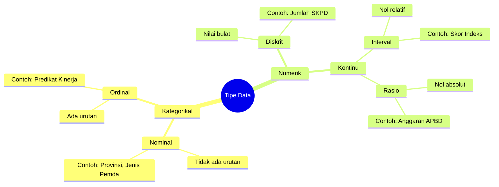
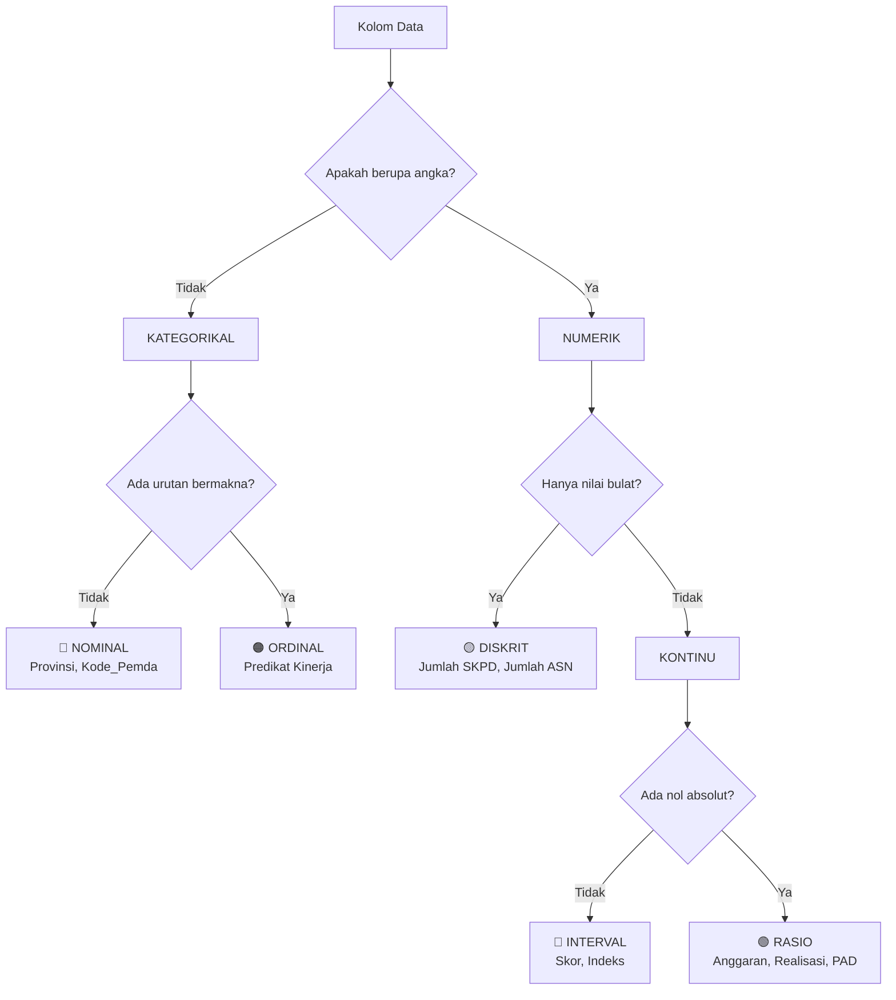
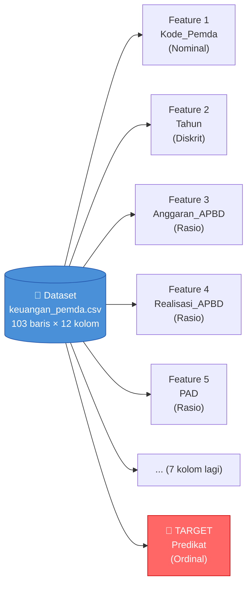
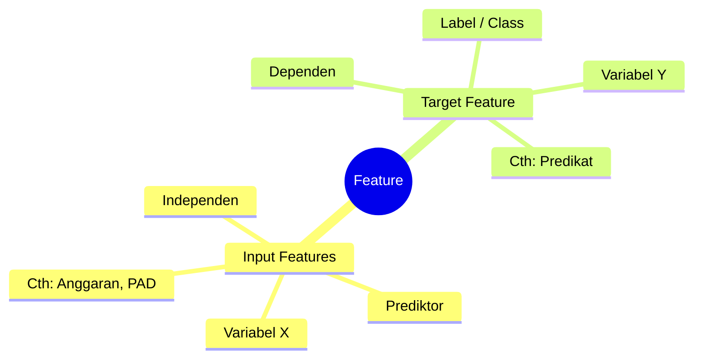

# Pengenalan & Tipe Data dalam Data Mining

**Mata Kuliah:** Analitika Data Keuangan Sektor Publik  
**Program Studi:** DIV | Topik: 01 – Pengenalan Data

---

## 1. Mengapa Tipe Data Penting?

Memahami tipe data adalah **fondasi utama** dalam analitika data. Pemilihan metode analisis, visualisasi, dan preprocessing sangat bergantung pada jenis data yang kita miliki.

> **Analogi:** Seperti memilih alat masak — panci untuk merebus, wajan untuk menggoreng. Salah memilih alat → hasil tidak optimal. Begitu pula dalam analisis data: salah memahami tipe data → analisis yang misleading.

---

## 2. Hierarki Tipe Data



---

## 3. Penjelasan Detail & Contoh dalam Konteks APBD

### 3.1 Data Kategorikal — Nominal

- **Definisi:** Kategori **tanpa urutan** atau peringkat
- **Operasi valid:** Hanya bisa dibandingkan sama (=) atau tidak sama (≠)
- **Representasi:** Kode, nama, label

| Kode_Pemda | Provinsi      | Jenis_Pemda |
|------------|---------------|-------------|
| PEMDA001   | Jawa Barat    | Kabupaten   |
| PEMDA002   | Jawa Tengah   | Kota        |
| PEMDA003   | Banten        | Provinsi    |
| PEMDA004   | Jawa Barat    | Kota        |

> ⚠️ Tidak ada urutan antara "Kabupaten", "Kota", dan "Provinsi" — ketiganya setara sebagai kategori

---

### 3.2 Data Kategorikal — Ordinal

- **Definisi:** Kategori **dengan urutan/peringkat** yang bermakna
- **Operasi valid:** Bisa dibandingkan lebih besar/kecil, tapi **jarak antar nilai tidak pasti sama**
- **Representasi:** Label bertingkat

| Kode_Pemda | Predikat_Kinerja | Skor Urutan |
|------------|------------------|-------------|
| PEMDA001   | Kurang           | 1           |
| PEMDA002   | Cukup            | 2           |
| PEMDA003   | Baik             | 3           |
| PEMDA004   | Sangat Baik      | 4           |

> ⚠️ "Baik" > "Cukup" > "Kurang" ✓, tapi **selisih** antara level tidak tentu sama — tidak bisa langsung dijumlah atau dirata-rata

---

### 3.3 Data Numerik — Diskrit

- **Definisi:** Nilai **bilangan bulat**, tidak ada nilai pecahan di antara dua nilai berurutan
- **Operasi valid:** Semua operasi aritmetika (tapi hanya nilai bulat)

| Kode_Pemda | Jumlah_SKPD | Jumlah_Program | Jumlah_ASN |
|------------|-------------|----------------|------------|
| PEMDA001   | 32          | 145            | 5.420      |
| PEMDA002   | 28          | 112            | 3.890      |
| PEMDA003   | 41          | 203            | 7.215      |

> ⚠️ Tidak ada "32,5 SKPD" atau "112,7 program" — nilainya selalu bulat

---

### 3.4 Data Numerik — Kontinu (Interval & Rasio)

- **Definisi:** Nilai **dapat berupa pecahan**, ada nilai di antara dua nilai manapun
- **Interval:** Nol bersifat **relatif** (nol = titik referensi, bukan "tidak ada")
- **Rasio:** Nol bersifat **absolut** (nol = benar-benar tidak ada)

| Kode_Pemda | Anggaran_APBD   | Realisasi_APBD  | % Realisasi |
|------------|-----------------|-----------------|-------------|
| PEMDA001   | 2.350.000.000   | 2.112.500.000   | 89,89%      |
| PEMDA002   | 1.870.000.000   | 1.289.300.000   | 68,95%      |
| PEMDA003   | 950.000.000     | 190.000.000     | 20,00%      |

> ✅ Anggaran Rp 0 = benar-benar tidak ada anggaran → ini **Rasio**  
> ✅ "PEMDA002 menyerap 2× lebih sedikit dari PEMDA001" → perbandingan bermakna

---

## 4. Skala Pengukuran (Stevens, 1946)


| Skala        | Urutan | Jarak Sama | Nol Absolut | Contoh Kolom APBD          |
|--------------|:------:|:----------:|:-----------:|----------------------------|
| **Nominal**  |   ✗    |     ✗      |      ✗      | Kode_Pemda, Provinsi       |
| **Ordinal**  |   ✓    |     ✗      |      ✗      | Predikat (Kurang→Sangat Baik) |
| **Interval** |   ✓    |     ✓      |      ✗      | Skor_Indeks, Ranking       |
| **Rasio**    |   ✓    |     ✓      |      ✓      | Anggaran, Realisasi, PAD   |

---

## 5. Diagram Alir Identifikasi Tipe Data



---

## 6. Konsep Feature / Atribut / Dimensi

Dalam **Data Mining**, setiap **kolom** dalam dataset disebut **feature**, **atribut**, atau **dimensi**.



| Istilah             | Makna                                      | Contoh dalam APBD                        |
|---------------------|--------------------------------------------|------------------------------------------|
| **Feature / Atribut** | Variabel/karakteristik input             | `Anggaran_APBD`, `Realisasi_APBD`, `PAD` |
| **Dimensi**         | Jumlah total feature dalam dataset         | 11 feature = 11 dimensi                  |
| **Instance / Record** | Satu baris data (satu pengamatan)        | Data PEMDA001 tahun 2024                 |
| **Dataset**         | Kumpulan seluruh instance & feature        | `keuangan_pemda.csv` (103+ baris)        |

### Jenis Feature



---

## 7. Konsep Class / Label / Target

**Class / Label / Target** adalah **output yang ingin diprediksi** oleh model Data Mining.

### Ilustrasi Alur Prediksi

```
╔═══════════════════════════════╗       ╔═════════════╗       ╔══════════════════╗
║     INPUT (Features)          ║       ║             ║       ║  OUTPUT (Target) ║
║                               ║       ║   MODEL     ║       ║                  ║
║  Anggaran_APBD  = 5,2 M       ║  ──►  ║     AI      ║  ──►  ║  "Sangat Baik"   ║
║  Realisasi_APBD = 4,8 M       ║       ║   Klasifi-  ║       ║                  ║
║  PAD            = 1,2 M       ║       ║   kasi      ║       ║                  ║
║  Dana_Transfer  = 3,1 M       ║       ║             ║       ║                  ║
╚═══════════════════════════════╝       ╚═════════════╝       ╚══════════════════╝
```

| Konsep          | Definisi                                        | Contoh APBD                              |
|-----------------|-------------------------------------------------|------------------------------------------|
| **Class/Label** | Nilai yang diprediksi (kategorikal)             | Predikat: "Baik", "Kurang"               |
| **Target**      | Kolom tujuan prediksi                           | Kolom `Predikat`                         |
| **Ground Truth**| Label yang sudah diketahui (data latih)         | Predikat yang dihitung manual            |
| **Prediction**  | Output model untuk data baru                    | Predikat untuk PEMDA baru tahun depan    |

### Tugas dalam Data Mining Berdasarkan Target

| Jenis Tugas       | Target                | Contoh dalam APBD                         |
|-------------------|-----------------------|-------------------------------------------|
| **Klasifikasi**   | Kategorikal (class)   | Prediksi Predikat Kinerja (Baik/Kurang)   |
| **Regresi**       | Numerik (kontinu)     | Estimasi nilai Realisasi APBD tahun depan |
| **Clustering**    | Tidak ada (unsupervised) | Pengelompokan PEMDA berdasarkan profil |
| **Association**   | Tidak ada             | Pola hubungan antar komponen anggaran     |

---

## 8. Visualisasi Lengkap Dataset APBD

```
keuangan_pemda.csv — Peta Tipe Data

┌──────────┬──────┬──────────────┬──────────────┬──────────┬──────────────┬──────────┐
│Kode_Pemda│Tahun │Anggaran_APBD │Realisasi_APBD│    PAD   │Dana_Transfer │ Predikat │
│ Nominal  │Disk. │    Rasio     │    Rasio     │  Rasio   │    Rasio     │ Ordinal  │
├──────────┼──────┼──────────────┼──────────────┼──────────┼──────────────┼──────────┤
│ PEMDA001 │ 2024 │2.350.000.000 │2.112.500.000 │450000000 │ 1.800.000.000│  Baik    │
│ PEMDA002 │ 2024 │1.870.000.000 │1.289.300.000 │  NaN  ←──┤ 1.200.000.000│  Cukup   │ ← Missing
│ PEMDA003 │ 2024 │    NaN    ←──┤  900.000.000 │120000000 │   500.000.000│   ?      │ ← Missing
│ PEMDA101 │ 2024 │-10.000.000.000←  1.000.000.000│300000000│  700.000.000│  Kurang  │ ← Negatif
└──────────┴──────┴──────────────┴──────────────┴──────────┴──────────────┴──────────┘
                                    ↑                ↑
                              Tipe: Rasio      Ada Missing Value!
                              (Nol = tidak ada anggaran)
```

---

## 9. Ringkasan

| Tipe Data    | Contoh Kolom APBD              | Operasi yang Valid                   |
|--------------|--------------------------------|--------------------------------------|
| Nominal      | Kode_Pemda, Provinsi           | = , ≠                                |
| Ordinal      | Predikat_Kinerja               | = , ≠ , < , >                        |
| Diskrit      | Jumlah_SKPD, Tahun             | +, −, ×, ÷ (nilai bulat)             |
| Interval     | Skor_Indeks, Ranking           | +, − (perbandingan tidak bermakna)   |
| Rasio        | Anggaran, Realisasi, PAD       | +, −, ×, ÷ (semua operasi valid)     |

---

## 10. Referensi

- Fayyad, U. et al. (1996). *From Data Mining to Knowledge Discovery in Databases*. AAAI Press.
- Han, J., Kamber, M., & Pei, J. (2012). *Data Mining: Concepts and Techniques* (3rd ed.). Morgan Kaufmann.
- Stevens, S. S. (1946). *On the theory of scales of measurement*. Science, 103(2684), 677-680.

---

*Materi: Analitika Data Keuangan Sektor Publik | Program DIV*
