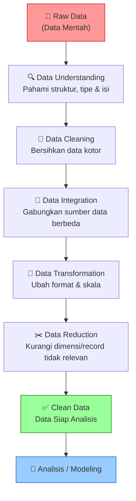
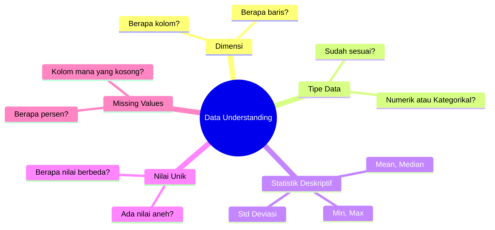
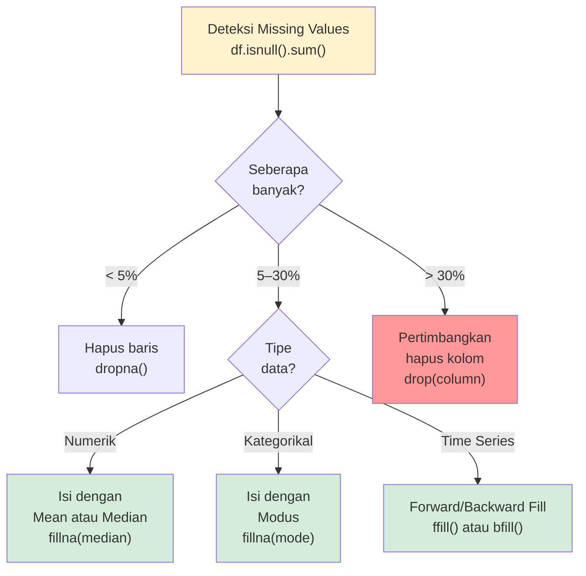
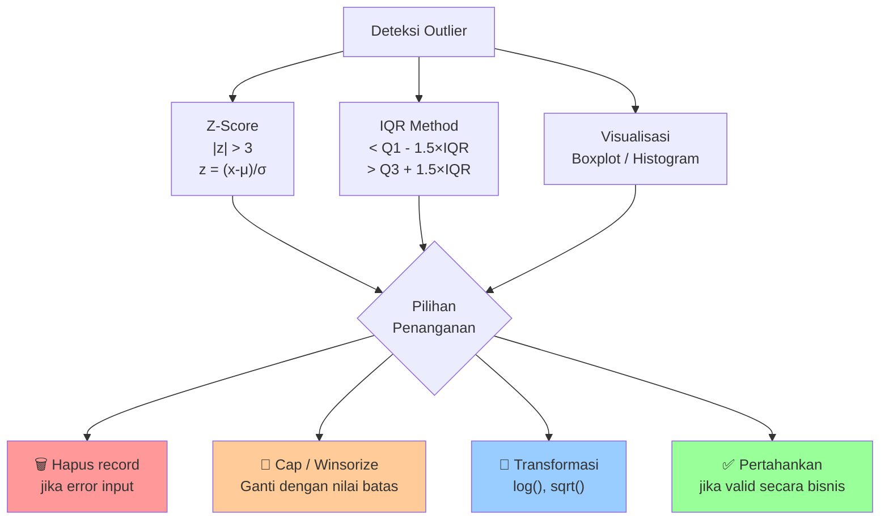
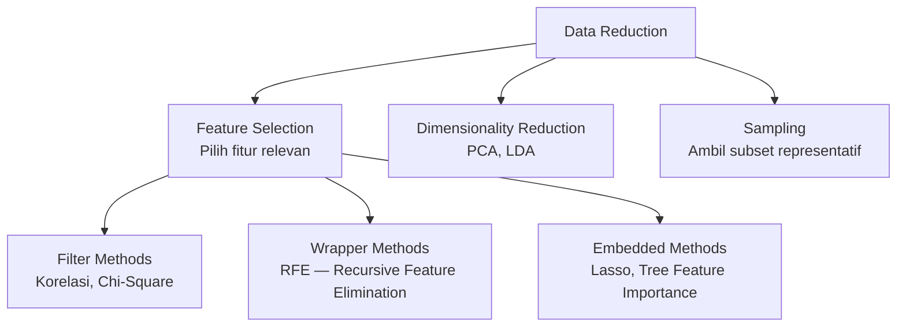
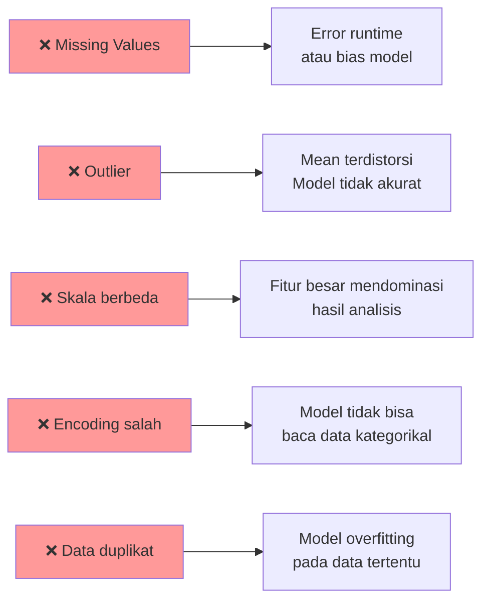

# Preprocessing Data

## 1. Apa itu Preprocessing Data?

Preprocessing data adalah serangkaian **proses membersihkan dan menyiapkan data mentah** menjadi format yang siap dianalisis oleh algoritma Data Mining.

Dalam praktik nyata, data keuangan pemerintah daerah sering mengandung masalah:

| Masalah Umum       | Contoh dalam Data APBD                                |
|--------------------|-------------------------------------------------------|
| Nilai hilang       | Kolom Anggaran_APBD kosong / NaN                      |
| Nilai tidak wajar  | Anggaran_APBD bernilai negatif                        |
| Outlier            | Realisasi 200% dari anggaran                          |
| Duplikasi          | PEMDA yang sama muncul dua kali di tahun yang sama    |
| Inkonsistensi      | "Jawa Barat" vs "jawa barat" vs "JABAR"               |
| Tipe data salah    | Kolom angka tersimpan sebagai teks                    |

> **Fakta Industri:** Ilmuwan data menghabiskan **60–80% waktu** mereka untuk preprocessing data, bukan untuk membangun model.

---

## 2. Alur Kerja Preprocessing



---

## 3. Tahap 1: Data Understanding (Pemahaman Data)

Sebelum membersihkan data, **kenali datamu terlebih dahulu**.



### Fungsi Python yang Digunakan

```python
import pandas as pd

df = pd.read_csv('keuangan_pemda.csv')

df.shape           # Dimensi: (baris, kolom)
df.dtypes          # Tipe data setiap kolom
df.info()          # Info lengkap + missing values
df.describe()      # Statistik deskriptif kolom numerik
df.head(5)         # 5 baris pertama
df.isnull().sum()  # Jumlah missing per kolom
df.nunique()       # Jumlah nilai unik per kolom
```

---

## 4. Tahap 2: Data Cleaning (Pembersihan Data)

### 4.1 Penanganan Missing Values (Nilai Hilang)



**Contoh Kasus Data APBD:**

```
Sebelum:
┌──────────┬──────────────────┐
│Kode_Pemda│ Anggaran_APBD    │
├──────────┼──────────────────┤
│ PEMDA001 │ 2.350.000.000    │
│ PEMDA002 │ NaN              │  ← Missing!
│ PEMDA003 │ 1.390.000.000    │
└──────────┴──────────────────┘

Sesudah (diisi median):
┌──────────┬──────────────────────────────┐
│Kode_Pemda│ Anggaran_APBD                │
├──────────┼──────────────────────────────┤
│ PEMDA001 │ 2.350.000.000                │
│ PEMDA002 │ 1.870.000.000  ← nilai median│
│ PEMDA003 │ 1.390.000.000                │
└──────────┴──────────────────────────────┘
```

> **Mengapa median?** Karena data keuangan sering memiliki distribusi miring (skewed). Median lebih robust terhadap outlier dibanding mean.

---

### 4.2 Penanganan Outlier (Pencilan)

**Apa itu Outlier?** Nilai yang sangat jauh dari distribusi normal data.



**Contoh — IQR Method pada Data APBD:**

```
Data Anggaran_APBD (Miliar Rp):
Q1 = 5.2 Miliar
Q3 = 18.7 Miliar
IQR = 13.5 Miliar

Batas bawah = 5.2 - (1.5 × 13.5) = -14.95 Miliar
Batas atas  = 18.7 + (1.5 × 13.5) = 38.95 Miliar

Outlier terdeteksi:
- PEMDA101: Anggaran = -10 Miliar  → negatif → kemungkinan error input
- PEMDA050: Anggaran = 500 Miliar  → sangat besar → perlu verifikasi
```

---

### 4.3 Penanganan Data Duplikat

```python
# Deteksi duplikat
print(df.duplicated().sum())

# Lihat baris duplikat
print(df[df.duplicated()])

# Hapus duplikat
df = df.drop_duplicates()

# Hapus duplikat berdasarkan kolom tertentu
df = df.drop_duplicates(subset=['Kode_Pemda', 'Tahun'])
```

---

### 4.4 Penanganan Inkonsistensi Nilai

```
Masalah Umum pada Data Pemerintah:
┌────────────────────┬───────────────────────────────────┐
│ Inkonsistensi      │ Contoh                            │
├────────────────────┼───────────────────────────────────┤
│ Kapitalisasi       │ "Jawa Barat" vs "jawa barat"      │
│ Singkatan          │ "Jawa Barat" vs "Jabar" vs "JaBar"│
│ Format angka       │ "1.000.000" vs "1000000"          │
│ Spasi ekstra       │ "Kurang " vs "Kurang"             │
│ Nilai tak bermakna │ "N/A", "-", ".", "#REF!"          │
└────────────────────┴───────────────────────────────────┘
```

```python
# Standarisasi teks
df['Provinsi'] = df['Provinsi'].str.strip().str.title()

# Ganti nilai tidak konsisten
df['Predikat'] = df['Predikat'].str.strip()
df['Predikat'] = df['Predikat'].replace({'sangat baik': 'Sangat Baik',
                                          'BAIK': 'Baik'})
```

---

## 5. Tahap 3: Data Transformation (Transformasi Data)

### 5.1 Normalisasi — Min-Max Scaling

Mengubah nilai ke rentang **[0, 1]**

$$X_{norm} = \frac{X - X_{min}}{X_{max} - X_{min}}$$

**Kapan digunakan?** Algoritma berbasis jarak: KNN, K-Means, Neural Network

```python
from sklearn.preprocessing import MinMaxScaler

scaler = MinMaxScaler()
df[['Anggaran_APBD', 'Realisasi_APBD']] = scaler.fit_transform(
    df[['Anggaran_APBD', 'Realisasi_APBD']]
)
```

---

### 5.2 Standardisasi — Z-Score

Mengubah distribusi ke **mean = 0, std = 1**

$$Z = \frac{X - \mu}{\sigma}$$

**Kapan digunakan?** Algoritma berbasis asumsi normal: regresi, SVM, PCA

```python
from sklearn.preprocessing import StandardScaler

scaler = StandardScaler()
df[['Anggaran_APBD', 'Realisasi_APBD']] = scaler.fit_transform(
    df[['Anggaran_APBD', 'Realisasi_APBD']]
)
```

---

### 5.3 Encoding Variabel Kategorikal

Algoritma Machine Learning **tidak bisa membaca teks** → harus diubah ke angka

| Metode              | Kapan Digunakan          | Contoh                                              |
|---------------------|--------------------------|-----------------------------------------------------|
| **Label Encoding**  | Data Ordinal             | Kurang=0, Cukup=1, Baik=2, Sangat Baik=3            |
| **One-Hot Encoding**| Data Nominal             | Provinsi → kolom terpisah (JaBar, JaTeng, dll.)     |
| **Binary Encoding** | Nominal + banyak kategori| Hemat memori dibanding One-Hot                      |

```python
# Label Encoding (untuk Ordinal)
from sklearn.preprocessing import LabelEncoder
le = LabelEncoder()
df['Predikat_Encoded'] = le.fit_transform(df['Predikat'])

# One-Hot Encoding (untuk Nominal)
df = pd.get_dummies(df, columns=['Provinsi'], prefix='Prov')
```

---

### 5.4 Feature Engineering

Membuat **fitur baru** dari fitur yang sudah ada untuk meningkatkan performa model.

```python
# Persen realisasi (fitur paling informatif!)
df['Pct_Realisasi'] = df['Realisasi_APBD'] / df['Anggaran_APBD'] * 100

# Rasio PAD terhadap total anggaran (kemandirian fiskal)
df['Rasio_Kemandirian'] = df['PAD'] / df['Anggaran_APBD'] * 100

# Selisih anggaran dan realisasi (sisa anggaran)
df['Sisa_Anggaran'] = df['Anggaran_APBD'] - df['Realisasi_APBD']
```

---

## 6. Tahap 4: Data Reduction (Reduksi Data)



---

## 7. Checklist Preprocessing

```
CHECKLIST PREPROCESSING DATA APBD
══════════════════════════════════════════════════════

✅ FASE 1 — DATA UNDERSTANDING
   □ df.shape → cek dimensi (baris × kolom)
   □ df.dtypes → cek tipe data setiap kolom
   □ df.describe() → statistik deskriptif
   □ df.isnull().sum() → deteksi missing values
   □ df.duplicated().sum() → deteksi duplikat

✅ FASE 2 — DATA CLEANING
   □ Tangani missing values (hapus/imputasi)
   □ Tangani outlier (hapus/cap/transform)
   □ Hapus baris duplikat
   □ Perbaiki inkonsistensi format/nilai
   □ Perbaiki tipe data yang salah

✅ FASE 3 — DATA TRANSFORMATION
   □ Encode variabel kategorikal
   □ Normalisasi/standardisasi nilai numerik
   □ Buat fitur baru jika relevan (feature engineering)

✅ FASE 4 — VALIDASI AKHIR
   □ Tidak ada missing values tersisa
   □ Semua tipe data sudah benar
   □ Range nilai masuk akal
   □ Distribusi data wajar
```

---

## 8. Dampak Jika Preprocessing Diabaikan



---

## 9. Studi Kasus: Dataset keuangan_pemda.csv

```
AUDIT DATA: keuangan_pemda.csv
═══════════════════════════════════════════════════════════════
MASALAH YANG DITEMUKAN:

┌─────────────────────────────────────────────────────────────┐
│ No │ Masalah               │ Kolom              │ Aksi      │
├────┼───────────────────────┼────────────────────┼───────────┤
│  1 │ Missing Values        │ Anggaran_APBD      │ Imputasi  │
│  2 │ Nilai Negatif         │ Anggaran_APBD      │ Verifikasi│
│  3 │ Outlier Ekstrem       │ Realisasi > 100%   │ Cap/hapus │
│  4 │ Inkonsistensi Predikat│ Predikat           │ Rekalk.   │
│  5 │ Data Duplikat (potens.)│ Kode_Pemda+Tahun  │ Deduplikasi│
└────┴───────────────────────┴────────────────────┴───────────┘

ATURAN BISNIS PREDIKAT:
  Sangat Baik  : Realisasi / Anggaran  > 90%
  Baik         : Realisasi / Anggaran 80%–90%
  Cukup        : Realisasi / Anggaran 60%–80%
  Kurang       : Realisasi / Anggaran  < 60%
═══════════════════════════════════════════════════════════════
```

---

## 10. Referensi

- Han, J., Kamber, M., & Pei, J. (2012). *Data Mining: Concepts and Techniques* (3rd ed.). Morgan Kaufmann.
- García, S., et al. (2015). *Data preprocessing in data mining*. Springer.
- McKinney, W. (2017). *Python for Data Analysis* (2nd ed.). O'Reilly Media.

---

*Materi: Analitika Data Keuangan Sektor Publik | Program DIV*
