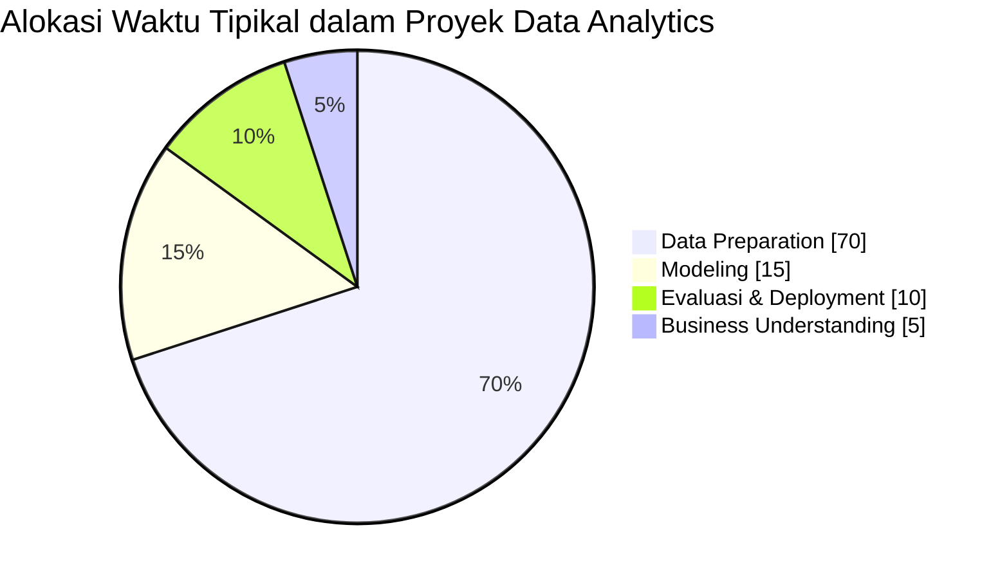
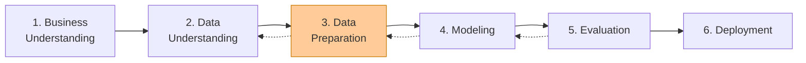
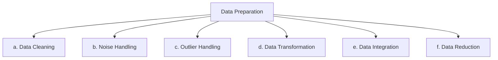
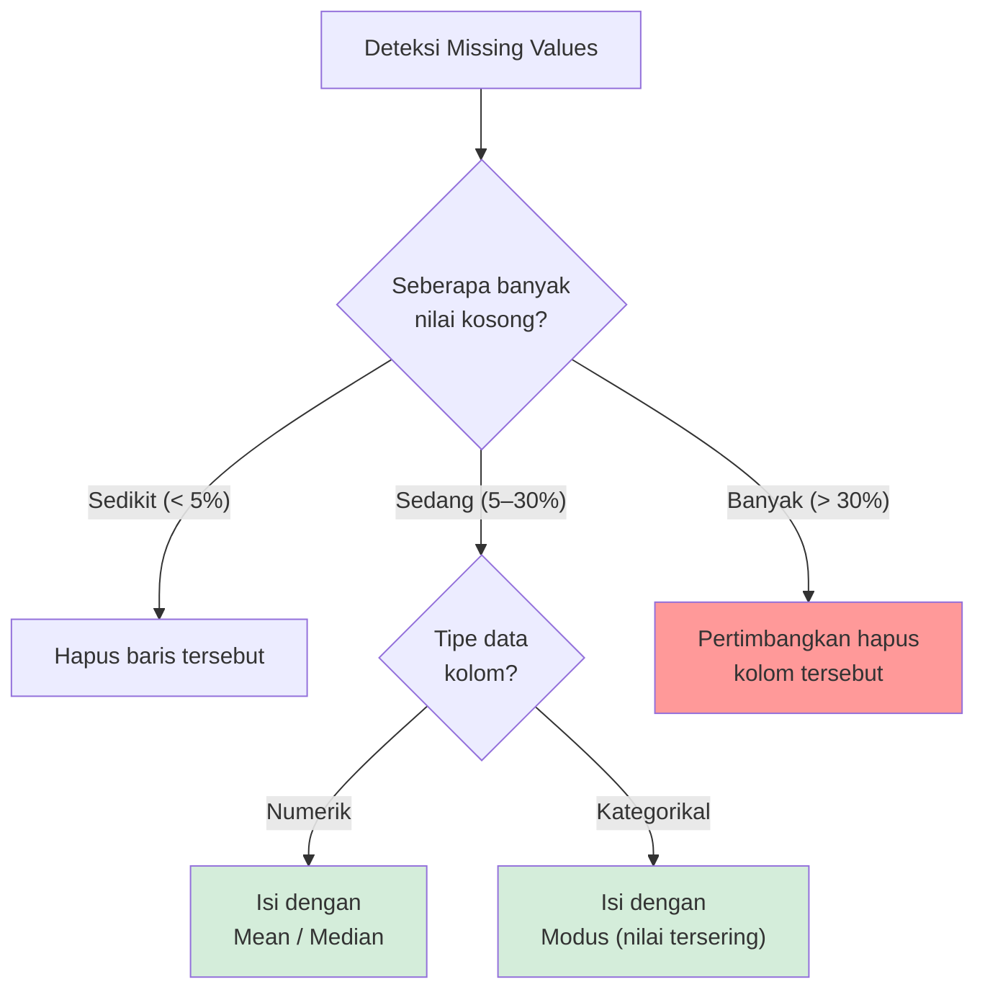
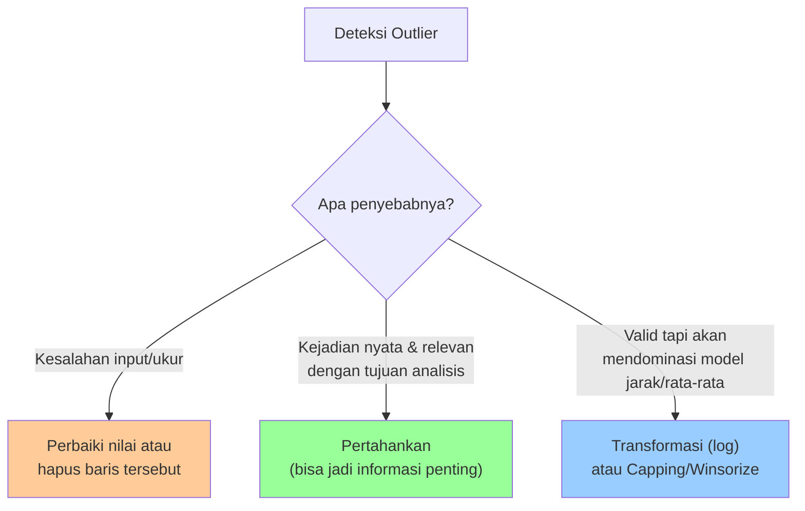
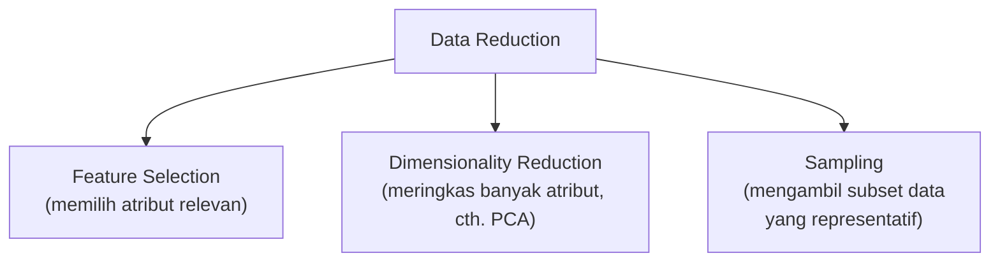
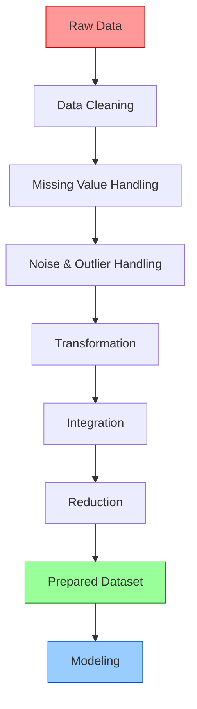

# Data Preparation
## Analitika Data Keuangan Sektor Publik

---

## 1. Pengertian Data Preparation

**Data Preparation** adalah tahapan dalam proses analisis data yang bertujuan mengubah data mentah (*raw data*) menjadi data yang **bersih, konsisten, dan siap dianalisis** oleh teknik statistik maupun algoritma Machine Learning. Tahap ini mencakup seluruh aktivitas yang dilakukan terhadap data setelah dikumpulkan, tetapi sebelum digunakan untuk membangun model — mulai dari memeriksa, memperbaiki, mengubah bentuk, hingga menyaring data.

Data mentah yang diperoleh dari lapangan — misalnya laporan realisasi anggaran, data layanan publik, hasil survei, atau log transaksi — hampir selalu memiliki masalah kualitas: ada nilai yang kosong, format penulisan yang tidak seragam, data ganda, atau nilai yang tidak masuk akal. Jika masalah ini tidak ditangani, hasil analisis dan model yang dibangun di atasnya akan **menyesatkan**, meskipun teknik analisis yang digunakan sudah canggih.

### Mengapa Data Preparation Memakan Waktu Paling Banyak?

Dalam praktik, Data Preparation dapat menghabiskan **60–80% dari total waktu proyek** Data Analytics, jauh lebih besar dibandingkan waktu untuk membangun model (Modeling) itu sendiri.



Hal ini terjadi karena beberapa alasan:

* **Data dunia nyata jarang datang dalam kondisi rapi.** Data hasil input manual, hasil ekspor sistem lama, atau gabungan beberapa sumber cenderung mengandung banyak inkonsistensi.
* **Diperlukan pemahaman konteks bisnis** untuk memutuskan cara menangani data bermasalah — misalnya, apakah nilai kosong pada kolom `Realisasi` berarti "belum dilaporkan" atau memang "nol rupiah"? Keputusan ini tidak bisa diambil hanya dengan melihat angka, harus dipahami dari sisi proses bisnisnya.
* **Prosesnya bersifat iteratif**, bukan satu kali jalan — cek data, bersihkan, cek ulang, temukan masalah baru, bersihkan lagi — hingga data benar-benar layak dianalisis.
* **Satu keputusan mempengaruhi keputusan lain.** Misalnya, cara mengisi missing value dapat memengaruhi hasil deteksi outlier pada langkah berikutnya.

### Hubungan dengan Kualitas Hasil Analisis dan Model

Kualitas dataset menentukan **batas atas (upper bound)** dari kualitas hasil analisis. Model Machine Learning secanggih apa pun — Random Forest, Neural Network, atau algoritma lainnya — tidak dapat menghasilkan kesimpulan yang benar jika data yang dipelajarinya penuh kesalahan.

> **Prinsip utama:** *"Garbage in, garbage out."* Kualitas hasil analisis dan model Machine Learning **tidak akan pernah melebihi kualitas data** yang menjadi masukannya. Model yang dilatih dari data kotor akan mempelajari pola yang salah, bukan pola yang sebenarnya.

Beberapa dampak konkret dari data yang tidak disiapkan dengan baik:

| Masalah pada Data | Dampak terhadap Analisis/Model |
|---|---|
| Missing values dibiarkan | Banyak algoritma gagal dijalankan (*error*), atau baris dengan data kosong otomatis dibuang sehingga informasi hilang |
| Outlier tidak ditangani | Nilai rata-rata dan model regresi terdistorsi, kesimpulan bias |
| Skala variabel berbeda jauh | Variabel dengan angka besar (misal anggaran dalam rupiah) mendominasi variabel lain dalam model berbasis jarak |
| Data kategorikal tidak di-*encode* | Sebagian besar algoritma Machine Learning tidak bisa membaca data berupa teks |
| Data duplikat | Model menjadi bias/*overfit* terhadap data yang muncul berulang |

---

## 2. Posisi Data Preparation dalam CRISP-DM

**CRISP-DM** (*Cross-Industry Standard Process for Data Mining*) adalah metodologi standar yang paling banyak digunakan dalam proyek Data Analytics dan Data Mining. Metodologi ini terdiri dari enam tahap yang saling berkaitan dan dapat berulang (*iteratif*), bukan berjalan searah secara kaku.



*Garis putus-putus menunjukkan bahwa proses dapat kembali ke tahap sebelumnya apabila ditemukan masalah baru — misalnya, saat Modeling ternyata membutuhkan variabel tambahan yang belum disiapkan.*

### Keterkaitan dengan Tahap Sebelum dan Sesudahnya

| Tahap | Peran terhadap Data Preparation |
|---|---|
| **Data Understanding** (sebelum) | Menghasilkan *temuan* — daftar masalah pada data: berapa banyak missing value, tipe data apa saja, distribusi seperti apa, ada outlier atau tidak |
| **Data Preparation** | *Menindaklanjuti* temuan tersebut — memperbaiki, mengubah, menggabungkan, dan menyaring data |
| **Modeling** (sesudah) | *Menggunakan* dataset hasil Data Preparation sebagai input untuk melatih model (misalnya klasifikasi, clustering, atau regresi) |

### Tujuan Utama Data Preparation

Tujuan akhir dari tahap ini adalah menghasilkan **dataset final** (sering disebut *analytical base table*) yang:

1. Bebas dari kesalahan struktural (missing value, duplikasi, format tidak konsisten).
2. Memiliki skala dan bentuk yang sesuai dengan algoritma yang akan digunakan.
3. Hanya berisi variabel yang relevan dengan tujuan analisis (Business Understanding).
4. Siap dimuat langsung ke perangkat analisis, baik **Orange Data Mining** (melalui widget File/Preprocess) maupun **Python** (melalui `pandas.DataFrame`).

---

## 3. Langkah-Langkah Utama Data Preparation

Secara umum, langkah-langkah Data Preparation dapat dikelompokkan sebagai berikut:



### a. Data Cleaning (Pembersihan Data)

Data Cleaning berfokus pada perbaikan kesalahan-kesalahan mendasar yang membuat data tidak dapat dipercaya atau tidak dapat diproses.

#### a.1 Missing Values (Nilai Hilang)

Nilai kosong dapat muncul karena responden tidak menjawab, sistem gagal mencatat, atau kolom memang tidak berlaku untuk baris tertentu.



**Contoh:** Kolom `Anggaran_APBD` kosong pada 8 dari 200 baris (4%) → cukup diisi dengan nilai median agar tidak terlalu dipengaruhi oleh anggaran yang sangat besar/kecil.

*Di Orange, gunakan widget **Impute**; di Python, gunakan `df.fillna()` atau `df.dropna()`.*

#### a.2 Duplicate Data (Data Duplikat)

Baris data yang identik atau mewakili entitas yang sama tercatat lebih dari satu kali.

**Contoh:** Data satuan kerja "Dinas Kesehatan Kota X" tahun 2026 tercatat dua kali karena kesalahan saat menggabungkan file laporan bulanan.

**Tujuan penanganan:** memastikan setiap entitas hanya dihitung satu kali, sehingga statistik (jumlah, rata-rata, total) tidak menjadi bias akibat pembobotan ganda.

#### a.3 Invalid Data (Data Tidak Valid)

Nilai yang secara logis tidak mungkin terjadi, meskipun secara format terlihat benar.

**Contoh:** `Persentase_Realisasi` bernilai 250%, atau `Jumlah_Penduduk` bernilai negatif. Nilai seperti ini menunjukkan adanya kesalahan input atau kesalahan satuan, dan perlu diverifikasi ulang ke sumber data sebelum diputuskan untuk dikoreksi atau dihapus.

#### a.4 Inconsistent Format (Format Tidak Konsisten)

Data yang sama secara makna, tetapi ditulis dengan format berbeda-beda sehingga sistem membacanya sebagai kategori yang berbeda.

**Contoh:**

```
Kolom Tanggal Lapor:
  "01-01-2026"
  "1 Januari 2026"
  "2026/01/01"
→ Ketiganya harus diseragamkan menjadi satu format, misalnya YYYY-MM-DD
```

**Tujuan penanganan:** memastikan data dapat dibandingkan, diurutkan, dan dikelompokkan dengan benar.

#### a.5 Typographical Error (Kesalahan Ketik)

Kesalahan penulisan yang menyebabkan satu kategori yang seharusnya sama justru terpecah menjadi beberapa kategori berbeda di mata sistem.

**Contoh:** "Jawa Barat", "Jawa Brat", "jawa barat", dan "JABAR" seharusnya dikenali sebagai satu kategori yang sama, namun tanpa pembersihan akan dihitung sebagai empat kategori terpisah — hal ini dapat merusak hasil agregasi maupun visualisasi.

> **Ringkasan Data Cleaning**

| Masalah | Tujuan Penanganan | Contoh |
|---|---|---|
| **Missing Values** | Mengisi/menghapus nilai kosong agar tidak mengganggu perhitungan | Kolom `Anggaran` kosong → diisi median |
| **Duplicate Data** | Menghindari bobot ganda pada entitas yang sama | Satker sama tercatat dua kali di tahun yang sama |
| **Invalid Data** | Mengoreksi/menghapus nilai yang tidak mungkin secara logis | Realisasi anggaran 250%, umur -5 |
| **Inconsistent Format** | Menyeragamkan format agar terbaca sebagai satu kategori | "01-2026" vs "Januari 2026" |
| **Typographical Error** | Memperbaiki salah ketik agar kategori tidak terpecah | "Jawa Barat" vs "jawa barat" |

*Di Orange Data Mining, sebagian besar langkah ini dilakukan dengan widget **Impute**, **Select Rows**, **Edit Domain**, dan **Preprocess**.*

---

### b. Data Noise Handling

**Data noise** adalah variasi atau kesalahan acak pada data yang tidak mencerminkan pola sebenarnya. Berbeda dengan outlier (yang merupakan satu nilai ekstrem), noise biasanya bersifat menyebar kecil-kecil di banyak titik data dan sulit dilacak sumbernya secara individual.

**Penyebab umum:**
* Kesalahan alat ukur atau sensor.
* Human error saat memasukkan data secara manual.
* Gangguan pada proses transmisi/pengumpulan data (misalnya jaringan yang tidak stabil saat entri data daring).

**Contoh data yang mengandung noise:**

```
Data Suhu Ruang Server (°C), tercatat tiap jam:
25, 26, 25, 999, 26, 25, 24, 26, 1, 25, 26 ...
                ↑                    ↑
        noise akibat error sensor (bukan pola nyata)
```

**Teknik sederhana untuk mengurangi noise:**

| Teknik | Cara Kerja Singkat |
|---|---|
| **Binning** | Mengelompokkan data ke dalam beberapa rentang/kelompok sehingga variasi kecil "diratakan" ke dalam satu kelompok yang sama |
| **Smoothing (moving average)** | Mengganti setiap nilai dengan rata-rata beberapa titik data di sekitarnya, sehingga fluktuasi acak berkurang |
| **Regresi/klasifikasi sederhana** | Memprediksi nilai yang seharusnya berdasarkan pola/tren dari data-data di sekitarnya, lalu nilai yang menyimpang digantikan dengan hasil prediksi tersebut |

> Noise yang tidak ditangani dapat membuat model "belajar" pola yang sebenarnya tidak ada, sehingga menurunkan akurasi prediksi pada data baru.

---

### c. Outlier Handling

**Outlier** adalah nilai data yang berbeda jauh dari mayoritas data lain dalam satu variabel. Outlier berbeda dari noise — outlier adalah satu (atau sedikit) nilai yang benar-benar ekstrem, sedangkan noise adalah variasi kecil yang tersebar di banyak data.

**Penyebab munculnya outlier:**

* **Kesalahan input** — misalnya salah ketik jumlah nol (Rp 1.000.000 tertulis Rp 1.000.000.000).
* **Kesalahan pengukuran/sistem** — sensor atau sistem pencatatan mengalami gangguan sesaat.
* **Kejadian nyata yang memang ekstrem** — misalnya realisasi belanja yang sangat besar karena adanya proyek strategis nasional, atau transaksi mencurigakan yang justru menjadi target deteksi fraud.



**Kapan outlier dipertahankan, kapan dihapus?**

| Kondisi | Tindakan yang Disarankan |
|---|---|
| Outlier terbukti berasal dari kesalahan input/pengukuran | Diperbaiki jika sumber aslinya diketahui, atau dihapus jika tidak dapat diverifikasi |
| Outlier merupakan kejadian nyata dan relevan dengan tujuan analisis | Dipertahankan — dalam kasus deteksi fraud atau anomali, outlier justru **menjadi target utama analisis**, bukan gangguan |
| Outlier valid tetapi akan mendominasi hasil model berbasis jarak/rata-rata | Dipertimbangkan untuk ditransformasi (misalnya transformasi logaritmik) atau dibatasi nilainya (*capping*), bukan langsung dihapus |

**Contoh sederhana (konteks APBD):**

```
Data Realisasi Anggaran (dalam %):
82, 85, 90, 88, 91, 250, 87, 89
                ↑
   250% → kemungkinan besar kesalahan input, perlu diverifikasi
```

**Metode deteksi outlier (konseptual):**

| Metode | Ide Dasar | Ambang Umum |
|---|---|---|
| **IQR (Interquartile Range)** | Data dianggap outlier jika berada jauh di luar "kotak" sebaran data, yaitu di bawah kuartil bawah (Q1) atau di atas kuartil atas (Q3) dengan jarak tertentu | Di luar Q1 − 1,5×IQR atau Q3 + 1,5×IQR |
| **Z-Score** | Data dianggap outlier jika jaraknya dari rata-rata (dalam satuan standar deviasi) melebihi ambang tertentu | Umumnya \|Z\| > 3 |

> Kedua metode ini tidak perlu dihitung manual pada tahap awal pembelajaran — cukup dipahami konsepnya. Di Orange Data Mining, deteksi outlier dapat langsung dilakukan dengan widget **Outliers**; di Python, dapat digunakan `scipy.stats.zscore()` atau perhitungan kuartil dengan `pandas`.

---

### d. Data Transformation

Transformasi mengubah bentuk, skala, atau representasi data agar sesuai dengan kebutuhan algoritma yang akan digunakan pada tahap Modeling.

#### d.1 Encoding Data Kategorikal

Sebagian besar algoritma Machine Learning hanya dapat memproses angka, sehingga data kategorikal (teks) perlu diubah menjadi bentuk numerik.

| Jenis Encoding | Kapan Digunakan | Contoh |
|---|---|---|
| **Label Encoding** | Data bersifat ordinal (memiliki urutan/tingkatan) | Kurang=0, Cukup=1, Baik=2, Sangat Baik=3 |
| **One-Hot Encoding** | Data bersifat nominal (tidak memiliki urutan) | Provinsi → kolom terpisah untuk tiap provinsi |

#### d.2 Normalization (Normalisasi)

Mengubah nilai numerik ke dalam rentang tertentu, umumnya **[0, 1]**, tanpa mengubah bentuk distribusi data.

**Contoh:** Anggaran dalam rupiah (jutaan hingga miliaran) diskalakan menjadi angka antara 0 dan 1, sehingga dapat dibandingkan secara adil dengan variabel lain seperti "jumlah pegawai" yang bernilai puluhan.

#### d.3 Standardization (Standardisasi)

Mengubah distribusi data sehingga memiliki **rata-rata = 0** dan **standar deviasi = 1**. Berguna terutama untuk algoritma yang mengasumsikan data berdistribusi normal.

#### d.4 Scaling

Istilah umum yang mencakup normalisasi maupun standardisasi — tujuannya menyamakan skala antar variabel yang satuannya berbeda jauh, misalnya "usia" (puluhan) dan "gaji" (jutaan rupiah), agar variabel dengan angka besar tidak secara tidak adil mendominasi perhitungan model.

#### d.5 Binning

Mengubah data numerik menjadi kategori/kelompok agar lebih mudah diinterpretasi atau untuk mengurangi pengaruh noise/outlier kecil.

**Contoh:** Variabel `Usia` (18–65 tahun) diubah menjadi kategori "Muda" (< 30), "Dewasa" (30–50), dan "Lansia" (> 50).

#### d.6 Feature Engineering (Pengenalan Singkat)

Membuat variabel baru yang lebih informatif dari variabel-variabel yang sudah ada, dengan memanfaatkan pemahaman konteks bisnis.

**Contoh:**

```
Persen_Realisasi   = Realisasi_APBD / Anggaran_APBD × 100
Rasio_Kemandirian  = PAD / Anggaran_APBD × 100
Sisa_Anggaran      = Anggaran_APBD − Realisasi_APBD
```

Ketiga variabel baru ini sering kali jauh lebih informatif dibandingkan variabel mentahnya, karena langsung merepresentasikan kondisi yang ingin dianalisis (kinerja penyerapan anggaran, kemandirian fiskal, dan sisa anggaran).

> **Ringkasan Data Transformation**

| Teknik | Tujuan | Contoh Singkat |
|---|---|---|
| Encoding | Mengubah data kategorikal menjadi angka | "Rendah/Sedang/Tinggi" → 0/1/2 |
| Normalization | Mengubah nilai ke rentang [0,1] | Anggaran diskalakan ke 0–1 |
| Standardization | Distribusi menjadi rata-rata 0, std 1 | Menyamakan skala antar variabel |
| Scaling | Istilah umum penyesuaian skala numerik | Menyamakan "usia" dan "gaji" |
| Binning | Data numerik → kategori | Usia → Muda/Dewasa/Lansia |
| Feature Engineering | Membuat variabel baru yang informatif | Persen_Realisasi = Realisasi/Anggaran |

*Di Orange Data Mining, teknik-teknik ini tersedia dalam satu widget **Preprocess** (berisi opsi Normalize, Discretize/Binning, Continuize/Encoding); di Python umumnya menggunakan modul `sklearn.preprocessing`.*

---

### e. Data Integration

**Data Integration** adalah proses menggabungkan data dari beberapa sumber — misalnya beberapa file CSV, tabel database, atau hasil beberapa survei berbeda — menjadi satu dataset yang koheren dan siap dianalisis bersama.

**Tantangan umum dalam integrasi data:**

| Tantangan | Contoh |
|---|---|
| **Perbedaan format** | Satu sumber menulis kode wilayah sebagai angka ("32"), sumber lain sebagai teks ("Jawa Barat") |
| **Perbedaan skema/nama kolom** | "Kab_Kota" pada satu file, "Kabupaten/Kota" pada file lain — padahal merujuk pada hal yang sama |
| **Perbedaan satuan** | Anggaran dicatat dalam rupiah pada satu sumber, dalam ribuan rupiah pada sumber lain |
| **Duplikasi antar sumber** | Entitas yang sama tercatat di lebih dari satu sumber dengan sedikit perbedaan penulisan nama |

**Contoh sederhana:**

```
Sumber 1 (data_anggaran.csv):     Sumber 2 (data_realisasi.csv):
Kode_Satker | Anggaran            Kode_Satker | Realisasi
S001        | 500.000.000         S001        | 470.000.000
S002        | 300.000.000         S002        | 295.000.000

Setelah digabung (join berdasarkan Kode_Satker):
Kode_Satker | Anggaran      | Realisasi
S001        | 500.000.000   | 470.000.000
S002        | 300.000.000   | 295.000.000
```

Penggabungan data yang tidak hati-hati dapat menimbulkan **data ganda** (jika kunci penggabungan tidak unik) atau **data yang saling bertentangan** (jika satu entitas memiliki nilai berbeda di sumber yang berbeda), sehingga proses ini perlu diverifikasi ulang setelah digabung — misalnya dengan memeriksa kembali jumlah baris dan mendeteksi duplikasi.

*Di Orange, penggabungan data dilakukan dengan widget **Merge Data**; di Python, dengan fungsi `pandas.merge()` atau `pandas.concat()`.*

---

### f. Data Reduction

**Data Reduction** bertujuan mengurangi jumlah atribut (kolom) atau jumlah data (baris) tanpa kehilangan informasi penting, sehingga proses analisis menjadi **lebih efisien, lebih cepat, dan lebih fokus** pada variabel yang benar-benar relevan.



* **Feature Selection** — memilih variabel yang paling relevan dengan tujuan analisis dan membuang variabel yang tidak berkontribusi, redundan, atau memiliki korelasi sangat tinggi dengan variabel lain.
* **PCA (Principal Component Analysis)** — teknik untuk meringkas banyak variabel menjadi sejumlah kecil komponen baru yang tetap mewakili sebagian besar informasi dari data asli. Pada tahap pembelajaran ini, PCA cukup dipahami sebagai konsep "meringkas dimensi data agar lebih sederhana", tanpa perlu mendalami perhitungan matematisnya.
* **Sampling** — mengambil sebagian data yang representatif dari keseluruhan populasi data, berguna ketika volume data sangat besar sehingga pemrosesan seluruh data menjadi tidak efisien.

**Contoh:** Dataset kinerja satuan kerja memiliki 40 kolom, tetapi hanya 8 kolom yang benar-benar berkaitan dengan tujuan analisis (misalnya prediksi risiko). Feature Selection membantu memilih ke-8 kolom tersebut sehingga model lebih sederhana, lebih cepat dilatih, dan lebih mudah diinterpretasikan.

*Di Orange, Data Reduction dapat dilakukan dengan widget **Select Columns**, **Rank**, atau **PCA**; di Python, dengan `sklearn.feature_selection` atau `sklearn.decomposition.PCA`.*

---

## 4. Ringkasan Proses Data Preparation

| Tahapan | Tujuan | Contoh |
|---|---|---|
| **Data Cleaning** | Memperbaiki data yang kosong, ganda, tidak valid, atau salah format | Mengisi missing value dengan median; menghapus baris duplikat |
| **Data Noise Handling** | Mengurangi variasi/kesalahan acak yang tidak mencerminkan pola sebenarnya | Smoothing nilai sensor yang melonjak tidak wajar |
| **Outlier Handling** | Menangani nilai ekstrem agar tidak mendistorsi hasil analisis | Deteksi outlier realisasi anggaran dengan metode IQR |
| **Data Transformation** | Menyesuaikan bentuk/skala data agar cocok untuk analisis/model | Normalisasi skala 0–1, encoding kategori, feature engineering |
| **Data Integration** | Menggabungkan data dari berbagai sumber menjadi satu dataset utuh | Menggabungkan data anggaran dan data realisasi per satker |
| **Data Reduction** | Menyederhanakan jumlah atribut/data agar proses lebih efisien | Feature selection sebelum training model |

### Checklist Praktis Sebelum Masuk ke Tahap Modeling

```
CHECKLIST DATA PREPARATION
════════════════════════════════════════════════
□ Tidak ada missing values yang belum ditangani
□ Tidak ada baris data duplikat
□ Semua nilai berada dalam rentang yang masuk akal (tidak ada invalid data)
□ Format penulisan (tanggal, teks kategori) sudah konsisten
□ Noise dan outlier sudah diperiksa dan ditangani sesuai konteksnya
□ Data kategorikal sudah di-encode menjadi angka
□ Skala variabel numerik sudah disesuaikan (normalisasi/standardisasi) bila diperlukan
□ Data dari berbagai sumber sudah digabung dan diverifikasi ulang
□ Hanya atribut yang relevan dengan tujuan analisis yang dipertahankan
════════════════════════════════════════════════
```

---

## 5. Kesimpulan

Data Preparation adalah tahap penting dalam CRISP-DM yang menjembatani pemahaman awal terhadap data (Data Understanding) dengan proses pembangunan model (Modeling). Tahap ini bersifat iteratif dan sangat bergantung pada pemahaman konteks bisnis, sehingga tidak dapat dilakukan secara otomatis sepenuhnya tanpa penilaian dari analis data.

Melalui rangkaian proses Data Cleaning, Noise Handling, Outlier Handling, Transformation, Integration, dan Reduction, mahasiswa diharapkan mampu menghasilkan dataset yang:

* **Bersih (Clean)** — bebas dari kesalahan, duplikasi, dan format yang tidak konsisten.
* **Lengkap (Complete)** — nilai yang hilang sudah ditangani secara tepat.
* **Konsisten (Consistent)** — format dan penamaan kategori seragam di seluruh dataset.
* **Valid (Valid)** — nilai berada dalam rentang yang masuk akal secara bisnis.
* **Siap digunakan untuk proses Modeling** — sudah dalam bentuk dan skala yang sesuai kebutuhan algoritma.

Penguasaan konsep-konsep ini menjadi bekal penting sebelum mahasiswa melakukan praktikum menggunakan **Orange Data Mining** maupun **Python**, karena kualitas data pada tahap ini akan menentukan validitas seluruh hasil analisis pada tahap-tahap berikutnya. Sebuah model yang sangat canggih sekalipun tidak akan mampu menghasilkan kesimpulan yang benar apabila dibangun di atas dataset yang belum disiapkan dengan baik.

---

## Diagram Alur Data Preparation



---

## Referensi

- Chapman, P., et al. (2000). *CRISP-DM 1.0: Step-by-step data mining guide*. SPSS Inc.
- Han, J., Kamber, M., & Pei, J. (2012). *Data Mining: Concepts and Techniques* (3rd ed.). Morgan Kaufmann.
- García, S., Luengo, J., & Herrera, F. (2015). *Data Preprocessing in Data Mining*. Springer.
- Orange Data Mining Documentation: https://orangedatamining.com/docs/
- McKinney, W. (2017). *Python for Data Analysis* (2nd ed.). O'Reilly Media.

---

*Materi: Analitika Data Keuangan Sektor Publik*
