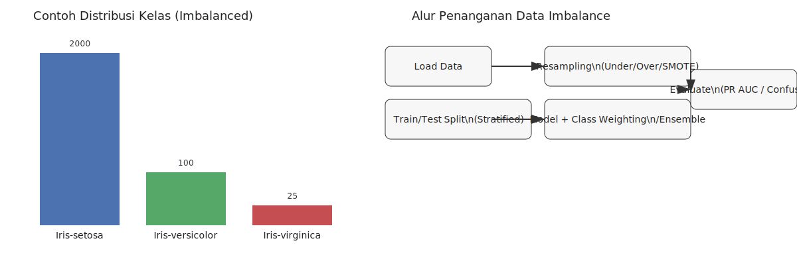

**Data Imbalance pada Klasifikasi**

Data imbalance (ketidakseimbangan kelas) terjadi ketika distribusi label pada dataset tidak merata: satu atau lebih kelas jauh lebih dominan dibanding kelas lain. Dalam konteks klasifikasi, imbalance dapat menyebabkan model "tertarik" ke kelas mayoritas sehingga performa terhadap kelas minoritas buruk meskipun akurasi keseluruhan tampak tinggi.

**Contoh:**
- **Kasus deteksi penipuan:** 0.5% transaksi penipuan vs 99.5% transaksi normal.
- **Kesehatan:** kasus penyakit langka (misal 1:1000) dibanding pasien sehat.
- **Iris (contoh buatan):** `Iris-setosa` 2000 baris, `Iris-versicolor` 100 baris, `Iris-virginica` 25 baris.

**Mengapa ini masalah?**
- **Bias pada metrik akurasi:** akurasi tinggi bisa dihasilkan hanya dengan menebak kelas mayoritas.
- **Minoritas dipelajari buruk:** model mendapatkan sedikit contoh untuk mempelajari pola kelas minoritas.
- **Kesalahan berbiaya tinggi:** di beberapa domain (fraud, medis) false negative pada minoritas jauh lebih mahal.

**Metode penanganan (ringkasan dan kapan digunakan):**

- **Under-sampling (mengurangi data kelas mayoritas):**
  - Deskripsi: kurangi jumlah sampel kelas mayoritas sehingga distribusi lebih seimbang.
  - Kelebihan: cepat, mengurangi waktu pelatihan.
  - Kekurangan: hilangnya informasi (potensi underfitting).
  - Contoh teknik: Random Undersampling, Cluster Centroids.

- **Over-sampling (menambah data kelas minoritas):**
  - Deskripsi: tambahkan sampel pada kelas minoritas sampai keseimbangan tercapai.
  - Kelebihan: tidak menghapus data asli.
  - Kekurangan: risiko overfitting (jika hanya menyalin sampel), lebih banyak waktu pelatihan.
  - Contoh teknik: Random Oversampling, SMOTE (Synthetic Minority Over-sampling Technique), ADASYN.

- **Hybrid (gabungan under + over):**
  - Deskripsi: gabungkan undersampling pada mayoritas dan oversampling sintetis pada minoritas.
  - Contoh: SMOTE + Tomek Links, SMOTEENN (SMOTE + Edited Nearest Neighbors).

- **Penyesuaian bobot kelas (class weighting):**
  - Deskripsi: berikan loss yang lebih besar untuk kesalahan pada kelas minoritas.
  - Kelebihan: tidak mengubah data; mudah digunakan dengan banyak algoritma (mis. Logistic Regression, SVM, RandomForest dengan parameter `class_weight`).

- **Algoritma dan pendekatan ensemble khusus:**
  - Balanced Random Forest, EasyEnsemble, RUSBoost (Random UnderSampling Boosting).
  - Kelebihan: memanfaatkan kekuatan ensemble sambil mengatasi imbalance.

- **Teknik sampling lanjutan dan pembersihan sampel:**
  - Tomek Links: menghapus pasangan sampel yang saling berdekatan dari kelas berbeda untuk membersihkan boundary.
  - Edited Nearest Neighbors (ENN): menghapus sampel yang tidak konsisten dengan tetangga terdekatnya.

- **Threshold moving / calibrated probabilities:**
  - Deskripsi: alih-alih memutuskan kelas pada threshold 0.5, geser threshold sesuai trade-off precision/recall.

- **Anomaly / outlier detection (untuk kasus ekstrem):**
  - Deskripsi: perlakukan kelas minoritas sebagai anomaly dan gunakan metode anomaly detection.

**Evaluasi & metrik yang direkomendasikan:**
- **Precision, Recall, F1-score:** lihat performa pada kelas minoritas.
- **ROC AUC vs PR AUC:** untuk dataset sangat tidak seimbang, PR AUC (Precision-Recall curve) sering lebih informatif.
- **Confusion Matrix:** lihat distribusi kesalahan per kelas.
- **Per-class metrics:** laporkan metrik terpisah untuk setiap kelas (macro/micro average).

**Praktik terbaik (pipeline dan tips):**
- Lakukan sampling (under/over) hanya pada data training setelah split — jangan lakukan sampling sebelum cross-validation karena menyebabkan data leak.
- Gunakan `Stratified` split/CV supaya proporsi kelas tetap pada fold.
- Saat memakai oversampling sintetis (SMOTE/ADASYN), kombinasi dengan metode pembersihan (Tomek/ENN) dapat mengurangi noise.
- Eksperimen dengan class weighting sebelum mencoba oversampling jika dataset sangat besar.
- Monitor tanda-tanda overfitting pada kelas minoritas (contoh: performa validation menurun saat training meningkat).

**Implementasi di Orange (widget yang relevan dan alur sederhana):**
- **File / Data Table:** muat dataset.
- **Select Columns:** pastikan kolom target telah diset.
- **Data Sampler / Resample:** untuk melakukan random undersampling atau oversampling (fitur ini tersedia sebagai `Data Sampler` atau melalui add-on tergantung versi Orange).
- **SMOTE (add-on):** beberapa add-on Orange menyediakan widget SMOTE atau fungsi oversampling sintetis — pasang add-on yang relevan jika belum tersedia.
- **Ensemble:** gunakan widget `Ensemble` untuk membangun metode bagging/boosting yang mendukung teknik balancing.
- **Test & Score / Cross Validation:** evaluasi model menggunakan `Test & Score` (pilih Stratified CV jika tersedia).
- **Confusion Matrix / ROC Analysis / Precision-Recall:** gunakan widget-widget evaluasi tersebut untuk menilai performa per kelas.

Catatan: ketersediaan nama widget bisa berbeda antar versi Orange dan add-on; jika suatu widget tidak ada, gunakan kombinasi `Data Sampler` + `Test & Score` atau instal add-on terkait (mis. add-on untuk sampling/SMOTE).

**Contoh alur kerja singkat di Orange:**
1. `File` → muat data.
2. `Select Columns` → tentukan target.
3. `Data Sampler` (undersample mayoritas) atau pasang `SMOTE` (oversample minoritas).
4. `Learner` (mis. Random Forest) → `Test & Score` → `Confusion Matrix` dan `PR Curve`.
5. Jika perlu, coba `Ensemble` atau `Resample + SMOTEENN` untuk hasil lebih stabil.

**Peringatan dan catatan akhir:**
- Oversampling sintetis (SMOTE/ADASYN) membuat contoh baru berdasarkan tetangga — berguna tapi bisa memperkenalkan noise jika fitur tidak relevan.
- Under-sampling yang agresif menghapus informasi; gunakan clustering-based undersampling jika ingin mempertahankan representatifitas data.
- Selalu evaluasi dengan metrik yang sesuai untuk kasus Anda (seringkali Recall atau PR AUC lebih penting daripada akurasi).

---

Referensi singkat:
- Chawla et al., "SMOTE: Synthetic Minority Over-sampling Technique".
- He & Garcia, "Learning from Imbalanced Data".
