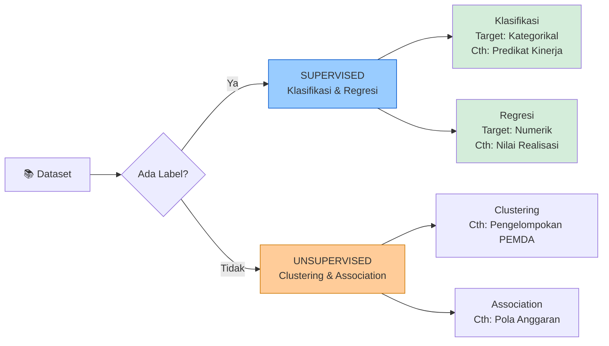
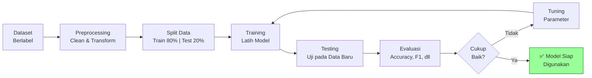

# Klasifikasi Data (Classification)

**Mata Kuliah:** Analitika Data Keuangan Sektor Publik  
**Program Studi:** DIV | Topik: 03 – Klasifikasi

---

## 1. Konsep Klasifikasi

Klasifikasi adalah teknik **Supervised Learning** yang bertujuan **memprediksi kategori/kelas** suatu data berdasarkan fitur-fitur yang ada. Model "belajar" dari data berlabel (training data) untuk kemudian memprediksi label pada data baru.

> **Analogi:** Seperti seorang auditor BPK yang menilai laporan keuangan sebagai "WTP", "WDP", atau "TMP" berdasarkan indikator yang sudah dipelajari dari kasus-kasus sebelumnya.

---

## 2. Supervised vs Unsupervised Learning



---

## 3. Alur Proses Klasifikasi



---

## 4. Algoritma Klasifikasi

### 4.1 Decision Tree (Pohon Keputusan)

Model yang membagi data berdasarkan **pertanyaan biner** secara hierarkis, seperti struktur pohon.

```
          [Pct_Realisasi ≥ 90%?]
               /          \
             Ya             Tidak
             ↓                ↓
       [SANGAT BAIK]   [Pct_Realisasi ≥ 80%?]
                            /          \
                          Ya             Tidak
                          ↓               ↓
                        [BAIK]   [Pct_Realisasi ≥ 60%?]
                                      /         \
                                    Ya            Tidak
                                    ↓               ↓
                                 [CUKUP]         [KURANG]
```

| Kelebihan                          | Kekurangan                           |
|------------------------------------|--------------------------------------|
| Mudah diinterpretasi & divisualisasi | Rentan overfitting                  |
| Tidak perlu normalisasi data       | Tidak stabil (sensitif terhadap data) |
| Bisa handle numerik & kategorikal  | Kurang optimal untuk data kompleks   |

---

### 4.2 K-Nearest Neighbor (KNN)

Mengklasifikasi berdasarkan **mayoritas kelas dari K tetangga terdekat** di ruang fitur.

```
Contoh K=3:

Data Baru: Anggaran=5B, Realisasi=4.6B → Pct=92%

  Tetangga 1 (jarak=0.3): Pct=91% → Sangat Baik  ←─┐
  Tetangga 2 (jarak=0.5): Pct=93% → Sangat Baik  ←─┤ Mayoritas: Sangat Baik
  Tetangga 3 (jarak=0.8): Pct=79% → Cukup         ←─┘

  Prediksi: SANGAT BAIK
```

| Kelebihan                    | Kekurangan                              |
|------------------------------|-----------------------------------------|
| Sederhana & intuitif         | Lambat untuk dataset besar              |
| Tidak perlu fase training    | Sensitif terhadap skala → perlu normalisasi |
| Adaptif terhadap batas kelas | Perlu menentukan K yang tepat           |

---

### 4.3 Naive Bayes

Berdasarkan **Teorema Bayes** dengan asumsi bahwa setiap fitur bersifat **independen** satu sama lain.

$$P(\text{Class}|\text{Features}) = \frac{P(\text{Features}|\text{Class}) \times P(\text{Class})}{P(\text{Features})}$$

**Contoh:**  
$P(\text{Sangat Baik} | \text{Pct} > 90\%) = \frac{P(\text{Pct} > 90\% | \text{Sangat Baik}) \times P(\text{Sangat Baik})}{P(\text{Pct} > 90\%)}$

| Kelebihan                        | Kekurangan                              |
|----------------------------------|-----------------------------------------|
| Cepat & efisien                  | Asumsi independensi sering tidak realistis |
| Baik untuk teks                  | Estimasi probabilitas kurang akurat     |
| Tidak butuh banyak data          | Kurang baik jika fitur berkorelasi kuat |

---

### 4.4 Perbandingan Algoritma

```mermaid
radar
  title Perbandingan Algoritma Klasifikasi
  Decision Tree : 8, 9, 6, 7, 8
  KNN           : 5, 4, 7, 9, 6
  Naive Bayes   : 7, 5, 9, 6, 7
  axis Interpretabilitas, Kecepatan Training, Kecepatan Prediksi, Akurasi, Ketahanan Outlier
```

---

## 5. Evaluasi Model Klasifikasi

### 5.1 Confusion Matrix

```
                    ┌─────────────────────────────────┐
                    │         PREDIKSI MODEL          │
                    │    Positif    │    Negatif       │
┌───────────────────┼───────────────┼─────────────────┤
│  AKTUAL  Positif  │  TP (Benar+)  │  FN (Salah-)    │
│          Negatif  │  FP (Salah+)  │  TN (Benar-)    │
└───────────────────┴───────────────┴─────────────────┘

TP = True Positive  : Diprediksi positif, aktualnya positif ✓
TN = True Negative  : Diprediksi negatif, aktualnya negatif ✓
FP = False Positive : Diprediksi positif, aktualnya negatif ✗ (Tipe I)
FN = False Negative : Diprediksi negatif, aktualnya positif ✗ (Tipe II)
```

### 5.2 Metrik Evaluasi

$$\text{Accuracy} = \frac{TP + TN}{TP + TN + FP + FN}$$

$$\text{Precision} = \frac{TP}{TP + FP}$$

$$\text{Recall (Sensitivity)} = \frac{TP}{TP + FN}$$

$$\text{F1-Score} = 2 \times \frac{\text{Precision} \times \text{Recall}}{\text{Precision} + \text{Recall}}$$

| Metrik        | Makna                                                   | Kapan Diprioritaskan             |
|---------------|---------------------------------------------------------|----------------------------------|
| **Accuracy**  | Proporsi prediksi benar dari total data                 | Data seimbang                    |
| **Precision** | Dari prediksi positif, berapa yang benar?               | Menghindari False Positive       |
| **Recall**    | Dari yang aktual positif, berapa yang terdeteksi?       | Menghindari False Negative       |
| **F1-Score**  | Keseimbangan antara Precision & Recall                  | Data tidak seimbang (imbalanced) |

---

## 6. Contoh Kasus: Prediksi Predikat Kinerja PEMDA

### Definisi Problem

```
INPUT (Features):                       OUTPUT (Target):
─────────────────────────────────       ─────────────────────
Anggaran_APBD                           Predikat Kinerja
Realisasi_APBD           → Model →      (Kurang / Cukup /
PAD                                      Baik / Sangat Baik)
Dana_Transfer
Belanja_Pegawai
```

### Aturan Bisnis (Rule-Based sebagai Baseline)

| Pct Realisasi | Predikat    |
|:-------------:|-------------|
| ≥ 90%         | Sangat Baik |
| 80% – 90%     | Baik        |
| 60% – 80%     | Cukup       |
| < 60%         | Kurang      |

> Dalam analisis lanjutan, model ML dapat menangkap pola yang lebih kompleks dari sekedar persentase realisasi.

---

## 7. Referensi

- Witten, I. H., Frank, E., & Hall, M. A. (2011). *Data Mining: Practical Machine Learning Tools and Techniques* (3rd ed.). Morgan Kaufmann.
- Mitchell, T. M. (1997). *Machine Learning*. McGraw-Hill.
- Scikit-learn documentation: https://scikit-learn.org/stable/supervised_learning.html

---

*Materi: Analitika Data Keuangan Sektor Publik | Program DIV*
