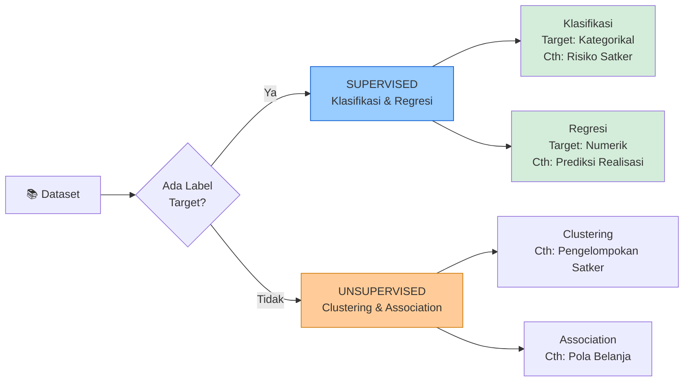
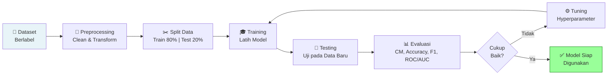
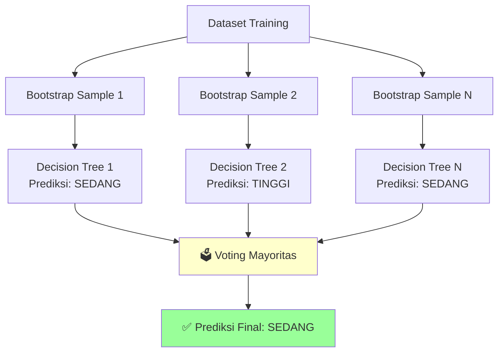
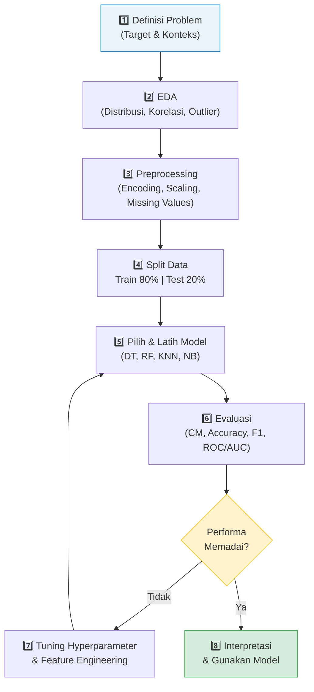

# Klasifikasi Data (Classification)
## Analitika Data Keuangan Sektor Publik

---

## 1. Apa Itu Klasifikasi?

Klasifikasi adalah teknik **Supervised Learning** yang bertujuan **memprediksi kategori/kelas** suatu data berdasarkan fitur-fitur yang ada. Model "belajar" dari data berlabel (*training data*) untuk kemudian memprediksi label pada data baru yang belum pernah dilihat sebelumnya.

> **Analogi :** Seperti seorang auditor BPK yang menilai laporan keuangan LKPD sebagai **"WTP"**, **"WDP"**, atau **"TMP"** berdasarkan indikator yang sudah dipelajari dari kasus-kasus sebelumnya. Atau seperti APIP yang mengkategorikan satuan kerja ke dalam risiko **Rendah / Sedang / Tinggi** berdasarkan profil pelaksanaan anggarannya.

### Contoh Kasus Klasifikasi di Sektor Publik

| Kasus | Input (Fitur) | Output (Target) |
|-------|--------------|-----------------|
| Prediksi Risiko Satker | Realisasi %, Revisi DIPA, Temuan Audit | Rendah / Sedang / Tinggi |
| Prediksi Opini BPK | Temuan material, SPI, Kepatuhan hukum | WTP / WDP / TW |
| Prediksi Kelulusan SP2D | Kelengkapan dokumen, nilai SPM | Lulus / Ditolak |
| Prediksi Kategori Satker | Tipe belanja, skala anggaran | Besar / Menengah / Kecil |
| Deteksi Anomali Keuangan | Pola transaksi, besaran nilai | Normal / Mencurigakan |

---

## 2. Supervised vs Unsupervised Learning



---

## 3. Alur Proses Klasifikasi



---

## 4. Algoritma Klasifikasi

### 4.1 Decision Tree (Pohon Keputusan)

Model yang membagi data berdasarkan **pertanyaan/kondisi** secara hierarkis membentuk struktur pohon. Setiap *node* internal adalah kondisi pada suatu fitur, setiap *leaf* adalah prediksi kelas.

```
         [Realisasi_Keuangan_Pct ≥ 85%?]
                    /           \
                  Ya              Tidak
                  ↓                 ↓
       [Temuan_Audit ≤ 2?]    [Realisasi ≥ 65%?]
           /       \               /        \
         Ya         Tidak        Ya           Tidak
         ↓            ↓          ↓              ↓
      RENDAH        SEDANG     SEDANG          TINGGI
```

**Konsep penting dalam Decision Tree:**
- **Gini Impurity / Entropy**: ukuran "ketidakmurnian" node — makin rendah makin baik
- **Information Gain**: selisih entropi sebelum dan sesudah split — algoritma pilih split tertinggi
- **Depth**: kedalaman pohon — terlalu dalam → overfitting, terlalu dangkal → underfitting

| Kelebihan | Kekurangan |
|-----------|-----------|
| Mudah diinterpretasi & divisualisasi | Rentan overfitting jika terlalu dalam |
| Tidak perlu normalisasi data | Tidak stabil (sensitif terhadap perubahan data) |
| Bisa handle data numerik & kategorikal | Bias ke fitur dengan banyak kategori |

---

### 4.2 Random Forest

Merupakan **ensemble** dari banyak Decision Tree. Setiap pohon dilatih pada subset data dan subset fitur secara acak, lalu prediksi akhir ditentukan berdasarkan **voting mayoritas**.



| Kelebihan | Kekurangan |
|-----------|-----------|
| Akurasi tinggi, tahan overfitting | Interpretasi sulit (black box) |
| Robust terhadap noise & outlier | Memerlukan memori & waktu lebih besar |
| Memberikan *feature importance* | Tidak ideal untuk dataset sangat kecil |

---

### 4.3 K-Nearest Neighbor (KNN)

Mengklasifikasi berdasarkan **mayoritas kelas dari K tetangga terdekat** di ruang fitur. Tidak ada fase training — model langsung mencari tetangga saat prediksi.

```
Contoh K=3 (prediksi risiko satker baru):

  Data Baru: Realisasi=72%, Temuan=4, Revisi=4

  Tetangga 1 (jarak=0.3): → Sedang  ←┐
  Tetangga 2 (jarak=0.5): → Sedang  ←┤ Mayoritas: SEDANG
  Tetangga 3 (jarak=0.8): → Tinggi  ←┘

  Prediksi: SEDANG
```

**Pilihan nilai K:**
- K kecil (K=1,3): model fleksibel tapi sensitif noise
- K besar (K=10,15): model stabil tapi bisa mengabaikan pola lokal
- Biasanya pilih K ganjil untuk menghindari seri

| Kelebihan | Kekurangan |
|-----------|-----------|
| Sederhana & intuitif | Lambat untuk dataset besar |
| Tidak ada asumsi distribusi data | Sensitif terhadap skala → **wajib normalisasi** |
| Adaptif terhadap batas kelas kompleks | Perlu menentukan K yang tepat |

---

### 4.4 Naive Bayes

Berdasarkan **Teorema Bayes** dengan asumsi bahwa setiap fitur bersifat **independen** satu sama lain (asumsi "naif").

$$P(\text{Kelas}|\text{Fitur}) = \frac{P(\text{Fitur}|\text{Kelas}) \times P(\text{Kelas})}{P(\text{Fitur})}$$

**Contoh:**
$$P(\text{Tinggi} \mid \text{Realisasi} < 65\%) = \frac{P(\text{Realisasi} < 65\% \mid \text{Tinggi}) \times P(\text{Tinggi})}{P(\text{Realisasi} < 65\%)}$$

| Kelebihan | Kekurangan |
|-----------|-----------|
| Cepat & efisien, cocok data besar | Asumsi independensi sering tidak realistis |
| Baik untuk klasifikasi teks | Estimasi probabilitas bisa kurang akurat |
| Tidak butuh banyak data training | Kurang baik jika fitur berkorelasi kuat |

---

### 4.5 Perbandingan Algoritma

| Aspek | Decision Tree | Random Forest | KNN | Naive Bayes |
|-------|:---:|:---:|:---:|:---:|
| Interpretabilitas | ⭐⭐⭐⭐⭐ | ⭐⭐ | ⭐⭐⭐ | ⭐⭐⭐ |
| Akurasi Umum | ⭐⭐⭐ | ⭐⭐⭐⭐⭐ | ⭐⭐⭐ | ⭐⭐⭐ |
| Kecepatan Training | ⭐⭐⭐⭐ | ⭐⭐⭐ | ⭐⭐⭐⭐⭐ | ⭐⭐⭐⭐⭐ |
| Tahan Overfitting | ⭐⭐ | ⭐⭐⭐⭐⭐ | ⭐⭐⭐ | ⭐⭐⭐⭐ |
| Perlu Normalisasi | Tidak | Tidak | **Ya** | Tidak |
| Konteks Publik | Sangat Baik | Sangat Baik | Baik | Baik |

---

## 5. Evaluasi Model Klasifikasi

Evaluasi model adalah tahap **kritis** untuk mengukur seberapa baik model bekerja pada data yang belum pernah dilihat. Jangan hanya mengandalkan satu metrik — gunakan kombinasi untuk mendapat gambaran lengkap.

---

### 5.1 Confusion Matrix

**Confusion Matrix** adalah tabel yang merangkum hasil prediksi model dibandingkan dengan nilai aktual. Ini adalah **fondasi** dari semua metrik evaluasi klasifikasi.

#### Untuk Klasifikasi Biner (2 Kelas)

```
                        ┌──────────────────────────────────────────┐
                        │           PREDIKSI MODEL                 │
                        │   Positif (+)    │    Negatif (-)        │
┌───────────────────────┼──────────────────┼───────────────────────┤
│  AKTUAL  Positif (+)  │  TP (True Pos.)  │  FN (False Neg.)      │
│          Negatif (-)  │  FP (False Pos.) │  TN (True Neg.)       │
└───────────────────────┴──────────────────┴───────────────────────┘
```

| Istilah | Keterangan | Contoh Konteks Audit |
|---------|-----------|---------------------|
| **TP** (True Positive)  | Prediksi Risiko Tinggi ✓ Aktual Risiko Tinggi | Satker berisiko → terdeteksi berisiko |
| **TN** (True Negative)  | Prediksi Risiko Rendah ✓ Aktual Risiko Rendah | Satker aman → terdeteksi aman |
| **FP** (False Positive) | Prediksi Risiko Tinggi ✗ Aktual Risiko Rendah | Satker aman → keliru dianggap berisiko |
| **FN** (False Negative) | Prediksi Risiko Rendah ✗ Aktual Risiko Tinggi | Satker berisiko → **lolos tidak terdeteksi** ⚠️ |

> **Catatan Penting:** Dalam konteks pengawasan keuangan, **False Negative (FN)** adalah kesalahan yang paling berbahaya — satker bermasalah yang tidak terdeteksi bisa menyebabkan kerugian negara yang lebih besar.

#### Untuk Klasifikasi Multi-Kelas

Contoh prediksi Kategori Risiko Satker (Rendah / Sedang / Tinggi):

```
                    ┌─────────────────────────────────────────────┐
                    │              PREDIKSI MODEL                 │
                    │   Rendah  │   Sedang  │   Tinggi            │
┌───────────────────┼───────────┼───────────┼─────────────────────┤
│ AKTUAL   Rendah   │    35     │     4     │      1              │
│          Sedang   │     3     │    30     │      7              │
│          Tinggi   │     0     │     2     │     28              │
└───────────────────┴───────────┴───────────┴─────────────────────┘

Diagonal (35, 30, 28) = prediksi BENAR
Di luar diagonal        = prediksi SALAH
```

---

### 5.2 Accuracy (Akurasi)

**Definisi:** Proporsi prediksi yang benar dari seluruh data.

$$\text{Accuracy} = \frac{TP + TN}{TP + TN + FP + FN} = \frac{\text{Prediksi Benar}}{\text{Total Data}}$$

**Contoh:** Dari 110 satker, model benar memprediksi 93 → Accuracy = 93/110 = **84.5%**

**Kapan gunakan:** Dataset **seimbang** (jumlah tiap kelas relatif sama).

> **Peringatan:** Jika hanya 5% satker berisiko Tinggi, model yang selalu prediksi "Rendah" akan punya Accuracy 95% tapi **gagal total** mendeteksi satker bermasalah!

---

### 5.3 Precision

**Definisi:** Dari semua yang diprediksi sebagai Positif, berapa yang benar-benar Positif?

$$\text{Precision} = \frac{TP}{TP + FP}$$

**Analogi:** Dari semua satker yang *dituduh* berisiko Tinggi oleh model, berapa % yang memang benar berisiko Tinggi?

**Kapan diprioritaskan:** Saat **biaya FP tinggi** — misalnya, mengirim tim audit ke satker yang sebenarnya tidak bermasalah membuang sumber daya APIP.

---

### 5.4 Recall (Sensitivity / True Positive Rate)

**Definisi:** Dari semua yang aktualnya Positif, berapa yang berhasil terdeteksi model?

$$\text{Recall} = \frac{TP}{TP + FN}$$

**Analogi:** Dari semua satker yang *memang* berisiko Tinggi, berapa % yang berhasil *ditemukan* oleh model?

**Kapan diprioritaskan:** Saat **biaya FN tinggi** — dalam pengawasan keuangan, *melewatkan* satker bermasalah jauh lebih berbahaya daripada salah menandai satker yang aman.

---

### 5.5 F1-Score

**Definisi:** Rata-rata harmonik antara Precision dan Recall. Memberikan keseimbangan antara keduanya.

$$\text{F1-Score} = 2 \times \frac{\text{Precision} \times \text{Recall}}{\text{Precision} + \text{Recall}}$$

Nilai F1 mendekati 1 = model sangat baik; mendekati 0 = model buruk.

**Kapan gunakan:** Data **tidak seimbang** (*imbalanced*) — ketika satu kelas jauh lebih banyak dari kelas lain, seperti satker risiko Tinggi yang jumlahnya lebih sedikit.

---

### 5.6 Tabel Ringkasan Metrik

| Metrik | Formula | Makna Praktis | Prioritaskan Saat... |
|--------|---------|---------------|---------------------|
| **Accuracy** | (TP+TN) / Total | % prediksi benar keseluruhan | Data seimbang |
| **Precision** | TP / (TP+FP) | Seberapa tepat prediksi positif | Ingin hindari alarm palsu |
| **Recall** | TP / (TP+FN) | Seberapa banyak kasus positif terdeteksi | Ingin tidak ada yang terlewat |
| **F1-Score** | 2×P×R / (P+R) | Keseimbangan Precision & Recall | Data tidak seimbang |
| **Specificity** | TN / (TN+FP) | Kemampuan deteksi kelas negatif | Validasi kelas negatif |

> **Aturan praktis untuk pengawasan keuangan:**
> - Fokus *efisiensi* audit (tidak ingin salah tangkap) → prioritaskan **Precision**
> - Fokus *kelengkapan* pengawasan (tidak ingin ada yang lolos) → prioritaskan **Recall**
> - Ingin keseimbangan keduanya → gunakan **F1-Score**

---

### 5.7 Classification Report

`classification_report` di scikit-learn menampilkan semua metrik per kelas sekaligus:

```
              precision    recall  f1-score   support

      Rendah       0.92      0.94      0.93        40
      Sedang       0.83      0.80      0.81        40
      Tinggi       0.90      0.93      0.92        30

    accuracy                           0.89       110
   macro avg       0.88      0.89      0.89       110
weighted avg       0.89      0.89      0.89       110
```

- **support**: jumlah data aktual per kelas di test set
- **macro avg**: rata-rata sederhana (tiap kelas dihitung sama)
- **weighted avg**: rata-rata tertimbang berdasarkan jumlah data tiap kelas

---

### 5.8 ROC Curve (Receiver Operating Characteristic)

**ROC Curve** adalah grafik yang menunjukkan trade-off antara:
- **True Positive Rate (Recall)** di sumbu Y — "seberapa banyak yang terdeteksi"
- **False Positive Rate (1 - Specificity)** di sumbu X — "seberapa banyak alarm palsu"

pada berbagai ambang batas (*threshold*) keputusan.

```
TPR │ 1.0 ┤         ╭─────────────────
(Recall)   │      ╭──╯   Model Baik
    │ 0.8 ┤   ╭──╯        (AUC tinggi)
    │     │ ╭─╯
    │ 0.6 ┤╭╯
    │     │/  ← Garis Diagonal = Model Acak (AUC = 0.5)
    │ 0.4 ┤
    │ 0.2 ┤
    │ 0.0 ┼─────────────────────────── FPR
         0.0   0.2   0.4   0.6   0.8   1.0
                                  (1 - Specificity)
```

- **Kurva di atas diagonal** → model lebih baik dari tebakan acak
- **Semakin mendekati sudut kiri atas** → model semakin sempurna

---

### 5.9 AUC (Area Under the Curve)

**AUC** adalah luas area di bawah kurva ROC — nilai tunggal yang merangkum kualitas model secara keseluruhan, **independen dari threshold**.

$$\text{AUC} \in [0.0, 1.0]$$

| Nilai AUC | Interpretasi |
|:---------:|-------------|
| 1.00 | Model sempurna |
| 0.90 – 0.99 | Sangat baik (*Excellent*) |
| 0.80 – 0.89 | Baik (*Good*) |
| 0.70 – 0.79 | Cukup (*Fair*) |
| 0.60 – 0.69 | Lemah (*Poor*) |
| 0.50 | Sama seperti tebakan acak |

> **AUC berguna untuk membandingkan model** — jika Decision Tree AUC=0.85 dan Random Forest AUC=0.92, maka Random Forest lebih baik tanpa perlu menentukan threshold terlebih dahulu.

Untuk klasifikasi multi-kelas, AUC dihitung dengan pendekatan **One-vs-Rest (OvR)**.

---

### 5.10 Cross-Validation

Untuk menghindari bias dari satu pembagian data train/test, gunakan **K-Fold Cross-Validation**:

```
Data dibagi K=5 lipatan (fold):

Fold 1: [TEST] [train] [train] [train] [train] → Skor 1
Fold 2: [train] [TEST] [train] [train] [train] → Skor 2
Fold 3: [train] [train] [TEST] [train] [train] → Skor 3
Fold 4: [train] [train] [train] [TEST] [train] → Skor 4
Fold 5: [train] [train] [train] [train] [TEST] → Skor 5

Hasil Akhir: rata-rata ± standar deviasi dari 5 skor
```

```python
from sklearn.model_selection import cross_val_score
scores = cross_val_score(model, X, y, cv=5, scoring='f1_macro')
print(f"F1 CV: {scores.mean():.3f} ± {scores.std():.3f}")
```

---

## 6. Studi Kasus: Prediksi Risiko Satker (Satuan Kerja)

### Definisi Problem

**Tujuan:** Memprediksi **Kategori Risiko** satuan kerja berdasarkan profil pelaksanaan anggaran, untuk mendukung prioritisasi pengawasan APIP.

```
INPUT (Fitur):                            OUTPUT (Target):
──────────────────────────────────────    ──────────────────
Pagu_Anggaran_Juta                        Kategori_Risiko
Realisasi_Keuangan_Pct     → Model →      (Rendah / Sedang
Realisasi_Fisik_Pct                        / Tinggi)
Jumlah_Revisi_DIPA
Rata_Keterlambatan_SPM_Hari
Nilai_Temuan_Audit_Juta
Jumlah_Temuan_Audit
Tipe_Belanja_Dominan
```

### Aturan Bisnis sebagai Baseline

| Kondisi | Kategori Risiko |
|---------|:---------------:|
| Realisasi ≥ 85% AND Temuan ≤ 2 AND Revisi ≤ 2 | **Rendah** |
| Realisasi 65–85% OR Temuan 3–7 OR Revisi 3–5 | **Sedang** |
| Realisasi < 65% OR Temuan ≥ 8 OR Revisi ≥ 6 | **Tinggi** |

> Model ML dapat **menemukan pola yang lebih kompleks** dari aturan sederhana ini — misalnya, kombinasi realisasi rendah + banyak revisi + belanja modal besar yang secara bersama-sama meningkatkan risiko.

### Interpretasi Hasil untuk Pengambilan Keputusan

```
Hasil Model → Keputusan Pengawasan:

RENDAH  → Pemantauan rutin, cukup laporan periodik
SEDANG  → Asistensi & konsultasi, review berkala
TINGGI  → Prioritas pemeriksaan detail, eskalasi ke pimpinan
```

---

## 7. Overfitting dan Underfitting

Dua masalah utama yang perlu diwaspadai:

| Masalah | Tanda | Solusi |
|---------|-------|--------|
| **Underfitting** | Akurasi training & test sama-sama rendah | Tambah fitur, naikkan kompleksitas model |
| **Overfitting** | Akurasi training tinggi, test rendah (gap besar) | Pruning, regularisasi, kurangi fitur, tambah data |

**Tips mencegah overfitting di Decision Tree:**
- Batasi `max_depth` (misal `max_depth=5`)
- Set `min_samples_split` dan `min_samples_leaf`
- Gunakan `ccp_alpha` (cost-complexity pruning)

---

## 8. Alur Kerja Praktis (Ringkasan)



---

## 9. Referensi

- Witten, I. H., Frank, E., & Hall, M. A. (2011). *Data Mining: Practical Machine Learning Tools and Techniques* (3rd ed.). Morgan Kaufmann.
- Mitchell, T. M. (1997). *Machine Learning*. McGraw-Hill.
- Breiman, L. (2001). Random Forests. *Machine Learning*, 45(1), 5–32.
- Fawcett, T. (2006). An introduction to ROC analysis. *Pattern Recognition Letters*, 27(8), 861–874.
- Scikit-learn documentation: https://scikit-learn.org/stable/supervised_learning.html
-  RI. (2023). *Pedoman Pengelolaan Kinerja*. DJPB .

---

*Materi: Analitika Data Keuangan Sektor Publik*

