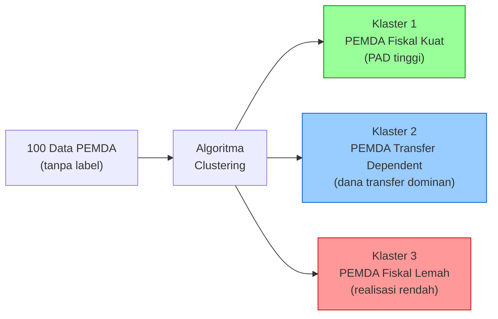
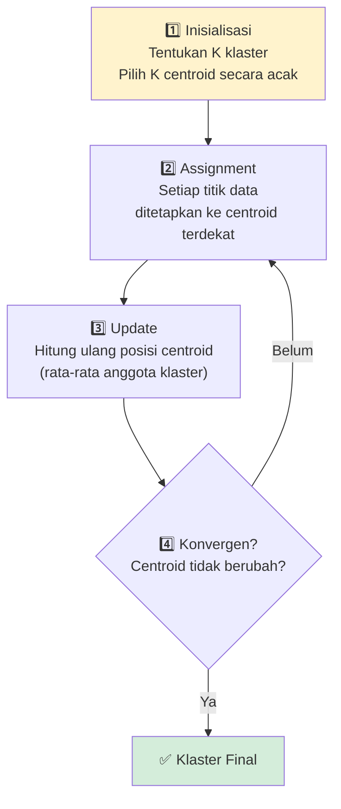
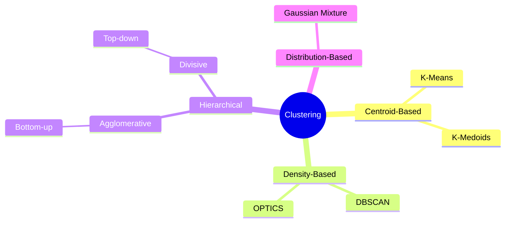
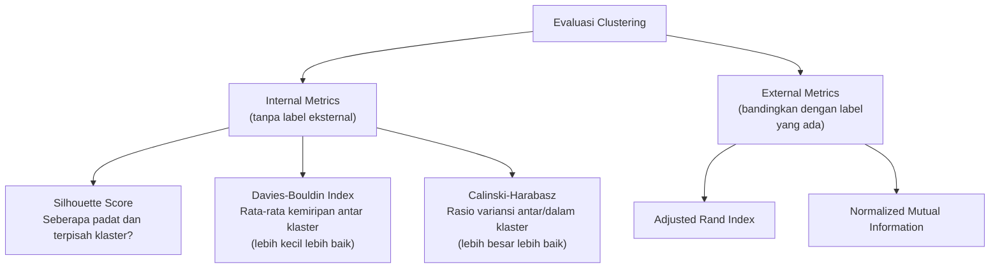

# Clustering (Pengelompokan Data)

**Mata Kuliah:** Analitika Data Keuangan Sektor Publik  
**Program Studi:** DIV | Topik: 04 – Clustering

---

## 1. Konsep Clustering

Clustering adalah teknik **Unsupervised Learning** yang mengelompokkan data ke dalam **klaster-klaster** berdasarkan kemiripan (similarity), **tanpa menggunakan label** yang sudah ditentukan sebelumnya.

> **Analogi:** Seperti Bank Indonesia yang mengelompokkan pemerintah daerah berdasarkan profil fiskalnya — tanpa terlebih dahulu menetapkan nama atau kategori kelompoknya. Pengelompokan muncul secara alami dari data.



---

## 2. Klasifikasi vs Clustering

| Aspek             | Klasifikasi (Supervised)         | Clustering (Unsupervised)           |
|-------------------|----------------------------------|-------------------------------------|
| Label             | Dibutuhkan (ada di data latih)   | Tidak dibutuhkan                    |
| Output            | Kelas yang sudah diketahui       | Kelompok baru yang ditemukan        |
| Evaluasi          | Accuracy, F1-Score               | Silhouette, Inertia                 |
| Contoh APBD       | Prediksi Predikat Kinerja        | Temukan pola profil fiskal          |

---

## 3. Algoritma K-Means

### 3.1 Cara Kerja



### 3.2 Ilustrasi pada Data APBD

```
Iterasi 1:
  C1 = (Anggaran: 3B, PAD: 0.5B)   → Klaster PEMDA Kecil
  C2 = (Anggaran: 12B, PAD: 2B)    → Klaster PEMDA Menengah
  C3 = (Anggaran: 25B, PAD: 5B)    → Klaster PEMDA Besar

Iterasi 2: centroid bergeser setelah assignment ulang...
Iterasi N: centroid stabil → Konvergen ✓
```

---

## 4. Menentukan Jumlah Klaster (K)

### 4.1 Elbow Method

Plot nilai **inertia** (jumlah kuadrat jarak titik ke centroidnya) untuk berbagai nilai K. Pilih K di titik "siku" (elbow).

```
Inertia
  │
  │ ●
  │   ●
  │      ●
  │         ●  ← ELBOW di K=3 (penurunan mulai landai)
  │              ●    ●    ●
  └──────────────────────────── K
     1    2    3    4    5    6
```

### 4.2 Silhouette Score

Mengukur seberapa baik setiap titik cocok di klasternya sendiri vs klaster tetangga.

$$s(i) = \frac{b(i) - a(i)}{\max(a(i), b(i))}$$

Dimana:
- $a(i)$ = rata-rata jarak ke anggota **klaster sendiri**
- $b(i)$ = rata-rata jarak ke anggota **klaster terdekat lainnya**

| Nilai Silhouette | Interpretasi                |
|:----------------:|-----------------------------|
| 0.71 – 1.00      | Struktur klaster sangat kuat |
| 0.51 – 0.70      | Struktur klaster wajar       |
| 0.26 – 0.50      | Struktur klaster lemah       |
| ≤ 0.25           | Tidak ada struktur bermakna  |

---

## 5. Jenis Algoritma Clustering Lainnya



### Perbandingan Singkat

| Algoritma      | Kelebihan                                  | Kekurangan                         |
|----------------|--------------------------------------------|------------------------------------|
| **K-Means**    | Cepat, simpel, skalabel                    | Perlu tentukan K, sensitif outlier |
| **DBSCAN**     | Temukan klaster bentuk bebas, outlier aware | Sensitif parameter, kurang baik untuk high-dim |
| **Hierarchical** | Tidak perlu tentukan K di awal, dendogram | Lambat untuk data besar            |

---

## 6. Evaluasi Hasil Clustering



---

## 7. Konteks APBD: Profil Fiskal PEMDA

### Tujuan Analisis
Mengelompokkan pemerintah daerah berdasarkan profil keuangannya untuk:
- Rekomendasi kebijakan fiskal yang tepat sasaran
- Identifikasi PEMDA yang butuh pendampingan
- Benchmarking antar PEMDA dalam kelompok yang sama

### Fitur yang Digunakan

| Feature                | Deskripsi                            |
|------------------------|--------------------------------------|
| `Pct_Realisasi`        | Persentase penyerapan anggaran       |
| `Rasio_Kemandirian`    | PAD / Total Anggaran                 |
| `Rasio_Transfer`       | Dana Transfer / Total Anggaran       |
| `Rasio_Belanja_Pegawai`| Belanja Pegawai / Total Belanja      |

### Contoh Hasil Clustering

```
Klaster 1 — "PEMDA Mandiri"
  Karakteristik: PAD tinggi, transfer rendah, realisasi baik
  PEMDA tipe: Kota besar (Bandung, Surabaya, Jakarta)

Klaster 2 — "PEMDA Bergantung Transfer"
  Karakteristik: PAD rendah, transfer dominan, realisasi cukup
  PEMDA tipe: Kabupaten di luar Jawa

Klaster 3 — "PEMDA Bermasalah"
  Karakteristik: Realisasi rendah, belanja pegawai tinggi
  Perlu: Pendampingan fiskal, peningkatan kapasitas
```

---

## 8. Referensi

- Han, J., Kamber, M., & Pei, J. (2012). *Data Mining: Concepts and Techniques* (3rd ed.). Morgan Kaufmann.
- Kaufman, L., & Rousseeuw, P. J. (2009). *Finding Groups in Data: An Introduction to Cluster Analysis*. Wiley.
- Scikit-learn: https://scikit-learn.org/stable/modules/clustering.html

---

*Materi: Analitika Data Keuangan Sektor Publik | Program DIV*
