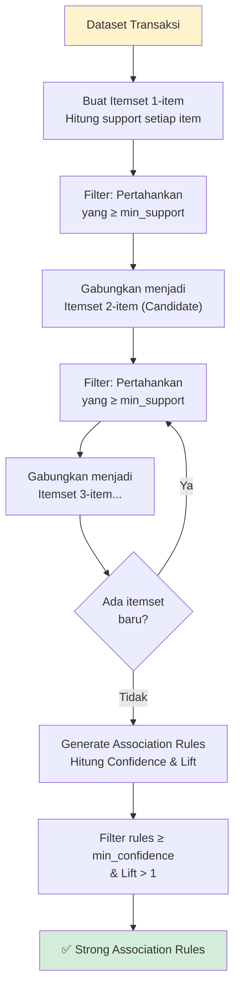
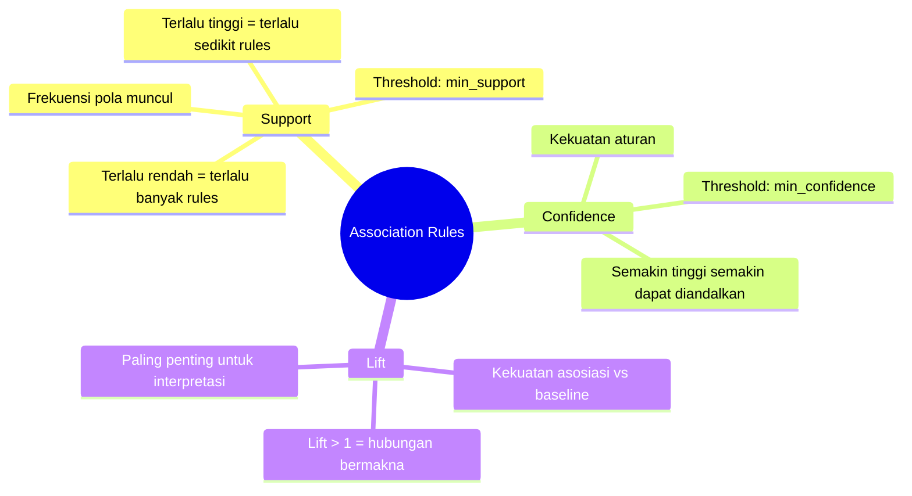

# Association Rules (Aturan Asosiasi)

## 1. Konsep Association Rules

Association Rules Mining adalah teknik **Unsupervised Learning** yang mencari **pola hubungan tersembunyi** antara item-item dalam suatu dataset transaksi.

> **Analogi Klasik:** Di supermarket — "Pelanggan yang membeli popok bayi, juga cenderung membeli bir" (ditemukan dari jutaan transaksi, bukan intuisi).

> **Konteks APBD:** "Pemerintah daerah yang merealisasi anggaran infrastruktur tinggi, juga cenderung memiliki realisasi pendidikan yang tinggi."

---

## 2. Komponen Utama

### Notasi Dasar

```
Aturan asosiasi ditulis sebagai:
  
  {A} → {B}
  
  Artinya: "Jika A terjadi, maka B kemungkinan juga terjadi"
  
Contoh APBD:
  {Realisasi_Infrastruktur: Tinggi} → {Realisasi_Pendidikan: Tinggi}
  {PAD: Rendah, Belanja_Pegawai: Tinggi} → {Realisasi: Kurang}
```

---

## 3. Tiga Metrik Kunci

### 3.1 Support (Dukungan)

Seberapa sering pola **{A dan B}** muncul dalam seluruh dataset.

$$\text{Support}(A \Rightarrow B) = \frac{\text{Jumlah transaksi mengandung A dan B}}{\text{Total transaksi}}$$

**Contoh:**  
Dari 100 PEMDA, 40 memiliki realisasi infrastruktur TINGGI dan realisasi pendidikan TINGGI.  
$\text{Support} = \frac{40}{100} = 0.40 = 40\%$

---

### 3.2 Confidence (Keyakinan)

Seberapa sering **{B}** muncul jika **{A}** sudah ada.

$$\text{Confidence}(A \Rightarrow B) = \frac{\text{Support}(A \cup B)}{\text{Support}(A)}$$

**Contoh:**  
50 PEMDA memiliki realisasi infrastruktur TINGGI. Dari 50 tersebut, 40 juga memiliki realisasi pendidikan TINGGI.  
$\text{Confidence} = \frac{40}{50} = 0.80 = 80\%$

---

### 3.3 Lift (Angkat)

Seberapa jauh **{A}** meningkatkan kemungkinan munculnya **{B}** dibanding kemungkinan dasarnya.

$$\text{Lift}(A \Rightarrow B) = \frac{\text{Confidence}(A \Rightarrow B)}{\text{Support}(B)}$$

| Nilai Lift | Interpretasi                                   |
|:----------:|------------------------------------------------|
| **> 1**    | A dan B **berkorelasi positif** (saling memperkuat) |
| **= 1**    | A dan B **independen** (tidak ada hubungan)    |
| **< 1**    | A dan B **berkorelasi negatif** (saling menghindari) |

**Contoh:**  
60 PEMDA memiliki realisasi pendidikan TINGGI.  
$\text{Support}(B) = \frac{60}{100} = 0.60$  
$\text{Lift} = \frac{0.80}{0.60} = 1.33$ → **Korelasi positif** ✓

---

## 4. Algoritma Apriori

### 4.1 Prinsip Apriori

> **Apriori Property:** Jika suatu itemset tidak memenuhi minimum support, maka semua *superset*-nya juga tidak akan memenuhi minimum support.

Ini memungkinkan pemangkasan ruang pencarian secara dramatis.

### 4.2 Alur Algoritma



---

## 5. Proses Transformasi Data APBD untuk Association Rules

Data APBD perlu **ditransformasi** menjadi format "transaksi biner" atau "keranjang":

### Langkah Diskretisasi

```python
# Ubah nilai numerik menjadi kategori (diskretisasi)
def kategorikan_realisasi(pct):
    if pct >= 90: return "Sangat Tinggi"
    elif pct >= 80: return "Tinggi"
    elif pct >= 60: return "Sedang"
    else: return "Rendah"

# Contoh transformasi:
# Sebelum:
# Kode_Pemda | Pct_Infrastruktur | Pct_Pendidikan | Pct_Kesehatan
# PEMDA001   |       91.5%       |     88.2%      |     79.3%
# PEMDA002   |       55.1%       |     62.0%      |     58.4%

# Sesudah:
# Kode_Pemda | Infrastruktur     | Pendidikan     | Kesehatan
# PEMDA001   | Sangat Tinggi     | Tinggi         | Sedang
# PEMDA002   | Rendah            | Sedang         | Rendah
```

### Format One-Hot untuk Apriori

```
Kode_Pemda | Infra_Tinggi | Infra_Rendah | Pend_Tinggi | Pend_Rendah | ...
PEMDA001   |      1       |      0       |      1      |      0      |
PEMDA002   |      0       |      1       |      0      |      1      |
```

---

## 6. Contoh Hasil Association Rules

```
Rules yang Ditemukan (min_support=0.3, min_confidence=0.7):

No │ Antecedent (If)              │ Consequent (Then)      │ Sup  │ Conf │ Lift
───┼──────────────────────────────┼────────────────────────┼──────┼──────┼─────
 1 │ {Infra: Tinggi}              │ {Pendidikan: Tinggi}   │ 0.40 │ 0.80 │ 1.33
 2 │ {PAD: Rendah, Transfer:Tinggi│ {Realisasi: Rendah}    │ 0.35 │ 0.75 │ 1.87
 3 │ {Belanja_Pegawai: Tinggi}    │ {Belanja_Modal: Rendah}│ 0.42 │ 0.84 │ 2.10
 4 │ {Predikat: SangatBaik}       │ {PAD: Tinggi}          │ 0.28 │ 0.93 │ 1.55
```

**Interpretasi Rule No. 3:**  
> "PEMDA yang memiliki proporsi belanja pegawai TINGGI, cenderung memiliki belanja modal yang RENDAH" — dengan kepercayaan 84% dan lift 2.10 (2× lebih sering terjadi dibanding kebetulan)

---

## 7. Ringkasan Metrik



---

## 8. Referensi

- Agrawal, R., & Srikant, R. (1994). *Fast algorithms for mining association rules*. VLDB.
- Han, J., Kamber, M., & Pei, J. (2012). *Data Mining: Concepts and Techniques* (3rd ed.).
- mlxtend library: https://rasbt.github.io/mlxtend/user_guide/frequent_patterns/apriori/

---

*Materi: Analitika Data Keuangan Sektor Publik | Program DIV*
