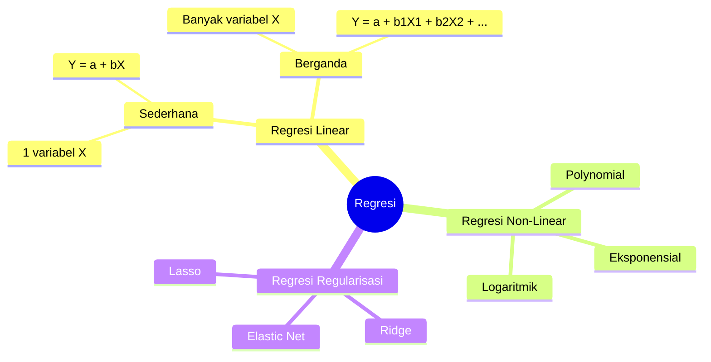
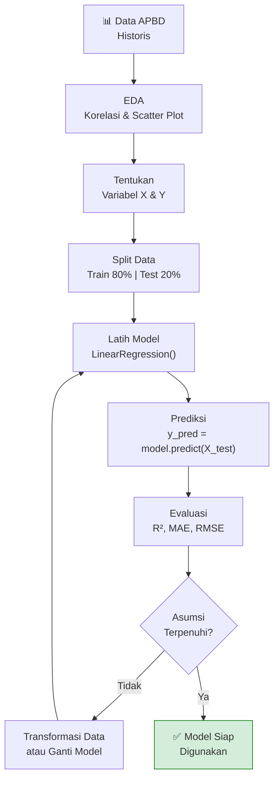

# Estimasi & Regresi (Estimation)

**Mata Kuliah:** Analitika Data Keuangan Sektor Publik  
**Program Studi:** DIV | Topik: 06 – Estimasi

---

## 1. Konsep Estimasi / Regresi

Regresi adalah teknik **Supervised Learning** yang memprediksi **nilai numerik kontinu** berdasarkan satu atau lebih variabel input.

> **Perbedaan dengan Klasifikasi:**  
> - Klasifikasi → Prediksi **kategori** (Baik/Kurang)  
> - Regresi → Prediksi **angka** (berapa nilai realisasi tahun depan?)

> **Analogi:** Seorang analis fiskal yang memperkirakan realisasi APBD tahun 2025 berdasarkan tren historis dan variabel makroekonomi.

---

## 2. Jenis Regresi



---

## 3. Regresi Linear Sederhana

### Model

$$Y = \beta_0 + \beta_1 X + \epsilon$$

Dimana:
- $Y$ = Variabel dependen (yang diprediksi) → Realisasi APBD
- $X$ = Variabel independen (prediktor) → Anggaran APBD
- $\beta_0$ = Intercept (titik potong sumbu Y)
- $\beta_1$ = Koefisien / Slope (kenaikan Y per kenaikan satu unit X)
- $\epsilon$ = Error / Residual

### Ilustrasi

```
Realisasi
(Miliar)
    │                                    /
 20 │                              ●  / ← Garis Regresi
    │                          ● /
 15 │                      ● /
    │                  ● /
 10 │              ● /
    │          ● /
  5 │      ● /
    │  ● /
    └─────────────────────────────── Anggaran (Miliar)
      5    10    15    20    25    30
```

---

## 4. Regresi Berganda (Multiple Regression)

$$Y = \beta_0 + \beta_1 X_1 + \beta_2 X_2 + ... + \beta_n X_n + \epsilon$$

**Contoh APBD:**

$$\text{Realisasi} = \beta_0 + \beta_1(\text{Anggaran}) + \beta_2(\text{PAD}) + \beta_3(\text{Dana\_Transfer}) + \epsilon$$

```python
# Hasil estimasi model (contoh):
# Koefisien:
#   Intercept   = -500.000.000
#   Anggaran    =  0.832   ← Setiap +1 Rp Anggaran, realisasi naik 0.832 Rp
#   PAD         =  0.124   ← Dampak PAD terhadap realisasi
#   Dana_Transfer =  0.695

# Interpretasi: Model menjelaskan 87.3% variasi dalam realisasi (R²=0.873)
```

---

## 5. Asumsi Regresi Linear (BLUE)

Model regresi OLS (Ordinary Least Squares) memerlukan asumsi **BLUE** (Best Linear Unbiased Estimator):

| Asumsi                | Deskripsi                                     | Cara Uji                     |
|-----------------------|-----------------------------------------------|------------------------------|
| **Linearitas**        | Hubungan X-Y bersifat linear                  | Scatter plot                 |
| **Normalitas Residual** | Error berdistribusi normal                  | Histogram residual, Q-Q plot |
| **Homoskedastisitas** | Variansi error konstan (tidak berubah)        | Scatter residual vs fitted   |
| **Independensi Error**| Error tidak berkorelasi satu sama lain        | Durbin-Watson test           |
| **Tidak ada Multikolinearitas** | Variabel X tidak berkorelasi tinggi satu sama lain | VIF (< 10) |

---

## 6. Metrik Evaluasi

### 6.1 R² (Koefisien Determinasi)

$$R^2 = 1 - \frac{\sum(Y_i - \hat{Y}_i)^2}{\sum(Y_i - \bar{Y})^2}$$

- Nilai: 0 sampai 1
- $R^2 = 0.87$ → Model menjelaskan 87% variasi data
- Semakin mendekati 1, semakin baik model

### 6.2 MAE (Mean Absolute Error)

$$MAE = \frac{1}{n} \sum_{i=1}^{n} |Y_i - \hat{Y}_i|$$

- Satuan sama dengan Y (Rupiah)
- Mudah diinterpretasi

### 6.3 RMSE (Root Mean Square Error)

$$RMSE = \sqrt{\frac{1}{n} \sum_{i=1}^{n} (Y_i - \hat{Y}_i)^2}$$

- Memberikan penalti lebih besar untuk error besar
- Satuan sama dengan Y (Rupiah)

### Perbandingan

| Metrik  | Rentang     | Lebih Kecil = Lebih Baik | Penalti Error Besar |
|---------|-------------|:------------------------:|:-------------------:|
| R²      | 0 – 1       | Lebih besar lebih baik   | –                   |
| MAE     | 0 – ∞       | ✓                        | Linear              |
| RMSE    | 0 – ∞       | ✓                        | Kuadratik           |

---

## 7. Alur Analisis Regresi



---

## 8. Konteks APBD: Estimasi Realisasi

### Problem Statement

Badan Keuangan Daerah ingin **memprediksi realisasi akhir tahun** sejak pertengahan tahun (misalnya, per Semester I) untuk pengambilan keputusan:
- Apakah perlu akselerasi penyerapan anggaran?
- Program mana yang butuh intervensi?

### Variabel

| Variabel              | Tipe       | Peran  |
|-----------------------|------------|--------|
| Anggaran_APBD         | Numerik    | Input X |
| PAD                   | Numerik    | Input X |
| Dana_Transfer         | Numerik    | Input X |
| Realisasi_Semester_I  | Numerik    | Input X |
| **Realisasi_Akhir**   | **Numerik**| **Target Y** |

---

## 9. Referensi

- Montgomery, D. C., Peck, E. A., & Vining, G. G. (2012). *Introduction to Linear Regression Analysis* (5th ed.). Wiley.
- James, G., et al. (2013). *An Introduction to Statistical Learning*. Springer.
- Scikit-learn: https://scikit-learn.org/stable/modules/linear_model.html

---

*Materi: Analitika Data Keuangan Sektor Publik | Program DIV*
