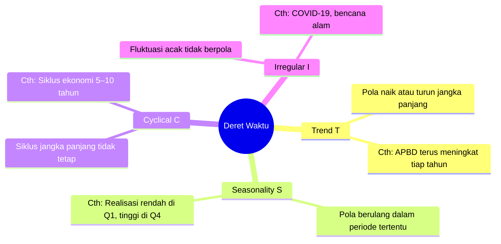
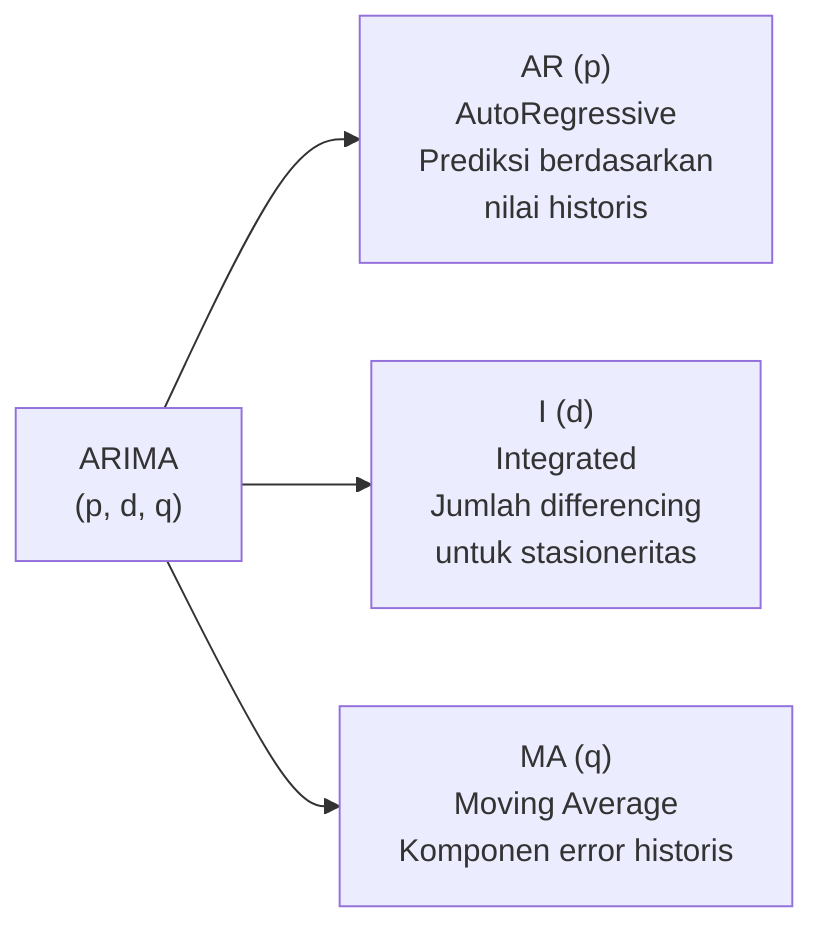
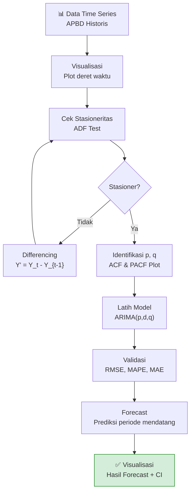

# Forecasting & Deret Waktu (Time Series)

## 1. Konsep Forecasting

Forecasting (peramalan) adalah proses **memprediksi nilai masa depan** berdasarkan pola historis data deret waktu (time series).

> **Konteks APBD:** Meramalkan besaran APBD tahun 2026 berdasarkan tren historis 2020–2024 untuk membantu proses perencanaan dan penganggaran.

---

## 2. Komponen Deret Waktu (Time Series)

Setiap data deret waktu mengandung empat komponen:



### Dekomposisi Time Series

```
APBD
(Triliun)
  │    
  │                               Trend (T)
  │                          ____/───────────
  │                     ____/
  │                ____/
  │           ____/
  │      ____/
  └──────────────────────────────────────────── Tahun
     2018  2019  2020  2021  2022  2023  2024

Setelah decompose:
  T = Tren jangka panjang (naik)
  S = Musiman (realisasi selalu rendah di Q1, tinggi Q4)
  C = Siklus ekonomi (sulit dihilangkan)
  I = Sisa/noise (COVID 2020 terlihat sebagai anomali)
```

---

## 3. Metode Forecasting

### 3.1 Moving Average (Rata-rata Bergerak)

Merata-rata nilai dalam **jendela waktu** tertentu untuk menghaluskan fluktuasi.

$$MA_t = \frac{1}{n} \sum_{i=0}^{n-1} Y_{t-i}$$

**Contoh — MA-3 untuk APBD:**

| Tahun | APBD (Triliun) | MA-3 (Triliun)     |
|-------|:--------------:|:------------------:|
| 2020  | 8.2            | –                  |
| 2021  | 8.7            | –                  |
| 2022  | 9.1            | (8.2+8.7+9.1)/3 = 8.67 |
| 2023  | 9.8            | (8.7+9.1+9.8)/3 = 9.20 |
| 2024  | 10.3           | (9.1+9.8+10.3)/3 = 9.73 |
| **2025**  | **?**      | (9.8+10.3+?)/3 ≈ **10.33** |

---

### 3.2 Exponential Smoothing

Memberikan **bobot lebih besar** pada data yang lebih baru.

$$\hat{Y}_{t+1} = \alpha Y_t + (1 - \alpha) \hat{Y}_t$$

- $\alpha$ = parameter smoothing (0 < α < 1)
- $\alpha$ mendekati 1 = lebih responsif terhadap data terbaru
- $\alpha$ mendekati 0 = lebih mengikuti tren historis

---

### 3.3 ARIMA (AutoRegressive Integrated Moving Average)

Model statistik yang menangkap **tren dan pola autokorelasi** dalam data.



**Parameter:**
- **p** (AR order): Berapa lag yang digunakan?
- **d** (differencing): Berapa kali diferensiasi untuk stasioner?
- **q** (MA order): Berapa lag error yang digunakan?

---

## 4. Alur Analisis Forecasting



---

## 5. Metrik Evaluasi Forecasting

| Metrik | Rumus | Keterangan |
|--------|-------|------------|
| **MAE** | $\frac{1}{n}\sum\|Y_t - \hat{Y}_t\|$ | Rata-rata error absolut |
| **RMSE** | $\sqrt{\frac{1}{n}\sum(Y_t - \hat{Y}_t)^2}$ | Penalti lebih besar untuk error besar |
| **MAPE** | $\frac{1}{n}\sum\left\|\frac{Y_t - \hat{Y}_t}{Y_t}\right\| \times 100\%$ | Error dalam persentase (mudah diinterpretasi) |

### Interpretasi MAPE

| MAPE       | Kualitas Forecasting |
|:----------:|----------------------|
| < 10%      | Sangat Baik          |
| 10% – 20%  | Baik                 |
| 20% – 50%  | Wajar                |
| > 50%      | Buruk                |

---

## 6. Perbandingan Metode

| Metode              | Kelebihan                              | Kekurangan                         | Kapan Digunakan              |
|---------------------|----------------------------------------|------------------------------------|------------------------------|
| **Moving Average**  | Sederhana, mudah dipahami              | Tidak menangkap tren               | Data stasioner tanpa tren    |
| **Exp. Smoothing**  | Responsif terhadap perubahan           | Tidak untuk pola seasonal kompleks | Data dengan tren ringan      |
| **ARIMA**           | Akurat, fleksibel                      | Perlu data yang cukup banyak       | Data dengan tren & autokorelasi |
| **Prophet (FB)**    | Menangkap seasonality, holiday effect  | Black-box, sulit diinterpretasi    | Data bisnis dengan pola musiman |

---

## 7. Konteks APBD: Proyeksi APBD

### Skenario Praktis

 ingin **memproyeksikan besaran APBD kabupaten/kota** untuk 3 tahun ke depan guna:
- Menentukan alokasi Dana Alokasi Umum (DAU)
- Merencanakan kapasitas fiskal daerah
- Deteksi dini daerah yang akan mengalami tekanan fiskal

### Contoh Output Forecast

```
Proyeksi APBD Provinsi X (Miliar Rp):

           Historis        │  Forecast
  ─────────────────────────┼──────────────────────
  2020: 8.200              │ 2025: 11.050 ± 350
  2021: 8.700              │ 2026: 11.780 ± 520
  2022: 9.100              │ 2027: 12.450 ± 720
  2023: 9.800              │
  2024: 10.300             │
                           │ Confidence Interval: 95%
```

---

## 8. Referensi

- Hyndman, R. J., & Athanasopoulos, G. (2021). *Forecasting: Principles and Practice* (3rd ed.). OTexts. https://otexts.com/fpp3/
- Box, G. E. P., Jenkins, G. M., et al. (2015). *Time Series Analysis: Forecasting and Control* (5th ed.). Wiley.
- statsmodels: https://www.statsmodels.org/stable/tsa.html

---

*Materi: Analitika Data Keuangan Sektor Publik*

