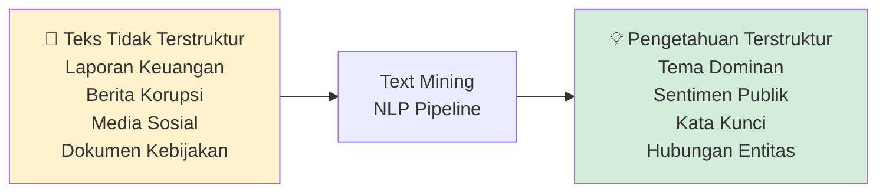
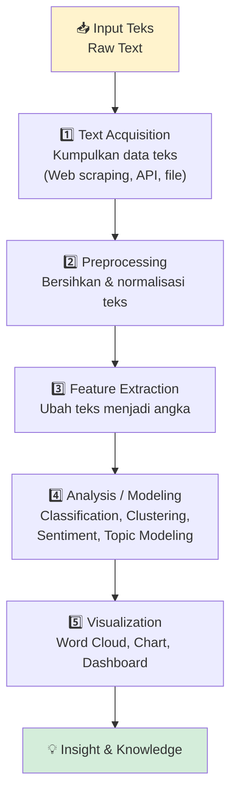
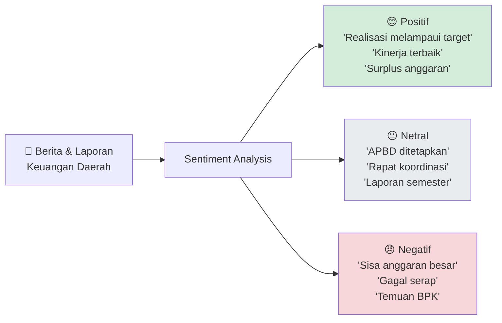
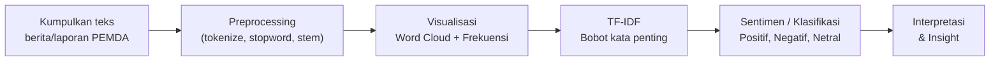

# Text Mining (Penambangan Teks)

## 1. Konsep Text Mining

Text Mining adalah proses **mengekstraksi informasi dan pengetahuan yang bermakna** dari data teks tidak terstruktur (unstructured text) menggunakan teknik komputasi.

> **Konteks Sektor Publik:**  
> 80% data pemerintah tersimpan dalam bentuk teks: laporan keuangan, LKPD, berita, media sosial, dokumen kebijakan, notulen rapat, dan opini masyarakat.



---

## 2. Pipeline Text Mining



---

## 3. Text Preprocessing

### 3.1 Tahapan Preprocessing Teks

| Tahap                 | Deskripsi                                      | Contoh                                     |
|-----------------------|------------------------------------------------|--------------------------------------------|
| **Case Folding**      | Ubah semua ke huruf kecil                      | "APBD" → "apbd"                            |
| **Tokenization**      | Pecah teks menjadi kata/token                  | "realisasi anggaran" → ["realisasi","anggaran"] |
| **Stop Word Removal** | Hapus kata tidak bermakna                      | "dan", "di", "yang", "dengan" → dihapus    |
| **Stemming**          | Ubah kata ke bentuk dasar (imbuhan dihapus)    | "merealisasikan" → "realisasi"             |
| **Lemmatization**     | Ubah ke bentuk kamus (lebih akurat)            | "berlari" → "lari"                         |
| **Noise Removal**     | Hapus karakter tidak relevan                   | angka, tanda baca, URL → dihapus           |

### 3.2 Ilustrasi Pipeline

```
Input:
"Realisasi APBD Kabupaten Sukabumi TAHUN 2024 mencapai 87.5%,
 lebih tinggi dari tahun lalu yang hanya 76.3%."

Setelah case folding:
"realisasi apbd kabupaten sukabumi tahun 2024 mencapai 87.5%,
 lebih tinggi dari tahun lalu yang hanya 76.3%."

Setelah tokenisasi + stop word removal + hapus angka/tanda baca:
["realisasi", "apbd", "kabupaten", "sukabumi", "mencapai",
 "tinggi", "tahun"]

Setelah stemming (Indonesian):
["realisasi", "apbd", "kabupat", "sukabumi", "capai",
 "tinggi", "tahun"]
```

---

## 4. Feature Extraction (Representasi Teks)

### 4.1 Bag of Words (BoW)

Merepresentasikan dokumen sebagai **vektor frekuensi kata**.

```
Dokumen 1: "anggaran belanja tinggi"
Dokumen 2: "anggaran pendapatan naik"
Dokumen 3: "belanja pegawai tinggi"

Kamus: [anggaran, belanja, tinggi, pendapatan, naik, pegawai]

Matrix BoW:
            anggaran  belanja  tinggi  pendapatan  naik  pegawai
Dok 1:         1        1       1          0         0      0
Dok 2:         1        0       0          1         1      0
Dok 3:         0        1       1          0         0      1
```

---

### 4.2 TF-IDF (Term Frequency — Inverse Document Frequency)

Memberikan **bobot lebih tinggi** pada kata yang sering muncul di dokumen tertentu tapi jarang di dokumen lain.

$$TF\text{-}IDF(t, d) = TF(t, d) \times IDF(t)$$

$$TF(t, d) = \frac{\text{Jumlah kemunculan } t \text{ di dokumen } d}{\text{Jumlah total kata di dokumen } d}$$

$$IDF(t) = \log\left(\frac{N}{\text{Jumlah dokumen mengandung } t}\right)$$

**Intuisi:** Kata "korupsi" yang muncul banyak di laporan tertentu tapi jarang di laporan lain → **bobot tinggi** (kata penting untuk dokumen itu).  
Kata "anggaran" yang muncul di semua laporan → **bobot rendah** (kata umum, kurang informatif).

---

## 5. Analisis Teks Populer

### 5.1 Analisis Sentimen

Menentukan **polaritas emosi** (positif, negatif, netral) dalam teks.



### 5.2 Topic Modeling (LDA)

Menemukan **tema/topik tersembunyi** dalam kumpulan dokumen besar.

```
100 LKPD Kabupaten/Kota →  Topic Modeling (LDA)

Topik 1 (30%): "infrastruktur, jalan, jembatan, konstruksi, proyek"
Topik 2 (25%): "pendidikan, sekolah, guru, beasiswa, kurikulum"
Topik 3 (20%): "kesehatan, rumah_sakit, puskesmas, vaksin, obat"
Topik 4 (15%): "korupsi, BPK, temuan, kerugian, pengembalian"
Topik 5 (10%): "PAD, retribusi, pajak_daerah, BUMD"
```

### 5.3 Word Cloud

Visualisasi frekuensi kata — semakin besar ukuran kata, semakin sering muncul.

---

## 6. Konteks APBD: Aplikasi Text Mining

| Sumber Data                  | Teknik Text Mining      | Output / Manfaat                             |
|------------------------------|-------------------------|----------------------------------------------|
| Berita media online          | Sentiment Analysis      | Sentimen publik terhadap kinerja PEMDA        |
| Laporan LHP BPK              | Topic Modeling + NER    | Pola temuan audit, deteksi risiko             |
| Dokumen APBD                 | Keyword Extraction      | Prioritas program anggaran                   |
| Aduan masyarakat (LAPOR!)    | Klasifikasi Teks        | Pengelompokan aduan otomatis                  |
| Media sosial Twitter/X       | Sentiment Analysis      | Persepsi publik terhadap kebijakan fiskal     |

---

## 7. Tools & Library

```python
# Library utama untuk Text Mining Python:
import nltk              # Natural Language Toolkit (umum)
from Sastrawi.Stemmer.StemmerFactory import StemmerFactory  # Stemming Bahasa Indonesia
from sklearn.feature_extraction.text import TfidfVectorizer  # TF-IDF
from wordcloud import WordCloud  # Word Cloud
import matplotlib.pyplot as plt

# Untuk analisis sentimen:
from textblob import TextBlob          # Bahasa Inggris
# IndoBERT / indobenchmark untuk Bahasa Indonesia
```

---

## 8. Alur Praktikum



---

## 9. Referensi

- Manning, C. D., & Schütze, H. (1999). *Foundations of Statistical Natural Language Processing*. MIT Press.
- Aggarwal, C. C. (2012). *Mining Text Data*. Springer.
- NLTK Book: https://www.nltk.org/book/
- Sastrawi (Indonesian Stemmer): https://github.com/har07/PySastrawi

---

*Materi: Analitika Data Keuangan Sektor Publik*
