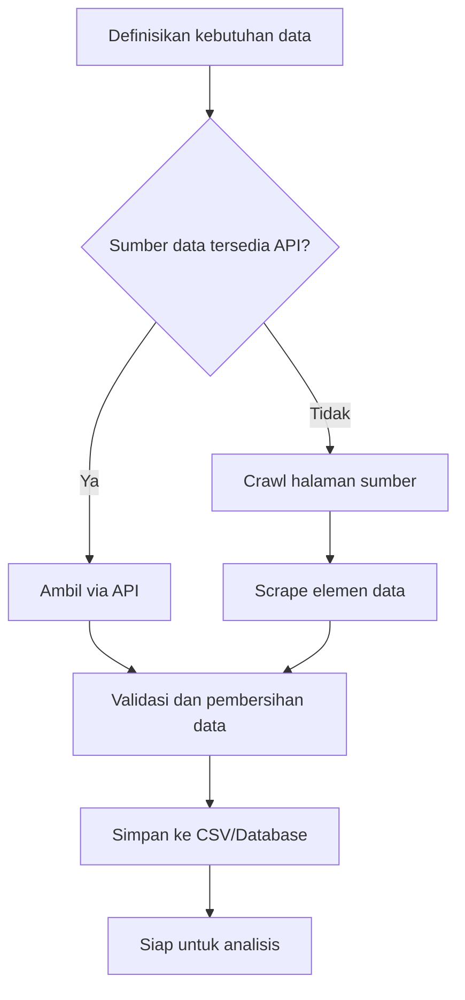
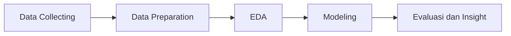

# Data Collecting: API Services, Crawl, dan Scrape

## 1. Pengantar Data Collecting

Data Collecting adalah proses memperoleh data dari berbagai sumber untuk dianalisis lebih lanjut.
Dalam praktik analitika sektor publik, data dapat diambil dari:

- API resmi pemerintah atau layanan publik
- Website lembaga (portal statistik, portal anggaran, berita)
- Dokumen publik berbasis web (tabel, artikel, laporan)

Tujuan akhirnya adalah mengubah data mentah menjadi dataset terstruktur yang siap dipakai untuk EDA, klasifikasi, clustering, estimasi, dan forecasting.

---

## 2. Tiga Pendekatan Utama

### 2.1 API Services

API (Application Programming Interface) menyediakan akses data secara terstruktur (umumnya JSON/XML) melalui endpoint.

Kelebihan:

- Struktur data lebih konsisten
- Lebih stabil dibanding scraping HTML
- Biasanya sudah disediakan dokumentasi resmi
- Cocok untuk otomasi jangka panjang

Kekurangan:

- Bisa membutuhkan API key/token
- Ada batas kuota (rate limit)
- Tidak semua data tersedia lewat API

### 2.2 Web Crawling

Crawling adalah proses menelusuri banyak halaman web secara otomatis dengan mengikuti tautan.

Kelebihan:

- Efektif untuk mengumpulkan banyak URL/halaman
- Dapat memetakan struktur situs

Kekurangan:

- Perlu kontrol agar tidak membebani server
- Berisiko melanggar aturan situs jika tidak hati-hati

### 2.3 Web Scraping

Scraping adalah proses mengekstrak informasi spesifik dari isi halaman web (misal tabel, judul berita, harga, metadata).

Kelebihan:

- Dapat mengambil data yang tidak disediakan API
- Fleksibel untuk banyak jenis halaman

Kekurangan:

- Rentan rusak jika struktur HTML berubah
- Sulit jika halaman sangat dinamis (render JavaScript)

---

## 3. Kapan Pakai API, Crawl, atau Scrape?

| Kondisi | Metode yang Disarankan |
|---|---|
| Data tersedia resmi dan terdokumentasi | API Services |
| Perlu menelusuri banyak halaman/arsip | Crawling + Scraping |
| Data hanya tampil di halaman web | Scraping |
| Halaman dinamis berbasis JavaScript | Scraping dengan browser automation |
| Proyek jangka panjang dan stabil | API lebih diutamakan |

Prinsip praktis: gunakan API terlebih dahulu. Jika API tidak tersedia atau tidak lengkap, lanjutkan dengan crawl/scrape.

---

## 4. Arsitektur Alur Pengambilan Data



---

## 5. API Services: Konsep Praktis

### 5.1 Komponen Dasar API

- Base URL: alamat utama layanan API
- Endpoint: jalur data spesifik, misalnya /v1/data
- Method HTTP: GET (ambil data), POST (kirim data), dst.
- Query parameter: filter data, misalnya tahun=2025
- Header: metadata request, termasuk Authorization
- Response: hasil data (umumnya JSON)

### 5.2 Contoh Alur Request API

1. Baca dokumentasi API
2. Daftar dan dapatkan API key (jika diperlukan)
3. Uji endpoint dengan parameter sederhana
4. Ambil data bertahap (pagination)
5. Simpan raw response
6. Transformasi ke format tabel

### 5.3 Contoh Kode Sederhana (Python)

```python
import requests
import pandas as pd

url = "https://api.example.go.id/v1/realisasi"
params = {"tahun": 2025, "provinsi": "Jawa Barat"}
headers = {"Authorization": "Bearer YOUR_API_TOKEN"}

resp = requests.get(url, params=params, headers=headers, timeout=30)
resp.raise_for_status()

data = resp.json()
df = pd.json_normalize(data["results"])
df.to_csv("realisasi_2025_jabar.csv", index=False)
```

Catatan:

- Gunakan timeout agar proses tidak menggantung
- Tangani error HTTP dengan raise_for_status
- Simpan hasil mentah untuk audit jejak data

---

## 6. Crawling dan Scraping: Konsep Praktis

### 6.1 Tahap Umum Crawl-Scrape

1. Tentukan URL awal (seed URL)
2. Ambil daftar tautan yang relevan
3. Filter tautan berdasarkan pola tertentu
4. Masuk ke setiap halaman target
5. Ekstrak elemen data yang dibutuhkan
6. Simpan hasil ke tabel terstruktur

### 6.2 Library Populer

- requests: mengambil konten halaman
- BeautifulSoup: parsing HTML
- Scrapy: framework crawling skala besar
- Selenium/Playwright: scraping halaman dinamis

### 6.3 Contoh Scraping Tabel HTML (Python)

```python
import requests
import pandas as pd
from bs4 import BeautifulSoup

url = "https://contoh-portal-data.go.id/laporan"
html = requests.get(url, timeout=30).text
soup = BeautifulSoup(html, "html.parser")

table = soup.find("table", {"id": "tabel-laporan"})
rows = []

for tr in table.find_all("tr")[1:]:
    cols = [td.get_text(strip=True) for td in tr.find_all("td")]
    if cols:
        rows.append(cols)

df = pd.DataFrame(rows, columns=["tahun", "instansi", "realisasi", "persentase"])
df.to_csv("laporan_scrape.csv", index=False)
```

---

## 7. Etika, Legalitas, dan Keamanan

Sebelum melakukan crawl/scrape, perhatikan hal berikut:

- Cek Terms of Service situs
- Patuhi robots.txt (khususnya area yang tidak boleh di-crawl)
- Hindari permintaan berlebihan (tambahkan jeda request)
- Jangan mengambil data pribadi sensitif tanpa dasar hukum
- Cantumkan sumber data dan waktu pengambilan
- Simpan log proses untuk akuntabilitas

Contoh kontrol laju request:

```python
import time
import random

# jeda acak 1-3 detik antar request
sleep_time = random.uniform(1, 3)
time.sleep(sleep_time)
```

---

## 8. Quality Check Data Hasil Collecting

Setelah data diperoleh, lakukan pemeriksaan:

- Kelengkapan: ada nilai hilang atau tidak
- Konsistensi format: tanggal, angka, satuan
- Duplikasi data: record ganda
- Validitas domain: nilai di luar rentang wajar
- Jejak data: URL sumber, timestamp, metode pengambilan

Checklist minimal:

- Jumlah baris sesuai ekspektasi
- Kolom utama terisi
- Tidak ada kolom kunci yang null
- Tidak ada duplikat pada ID unik

---

## 9. Studi Kasus Sektor Publik

### Kasus A: Data realisasi anggaran via API

- Sumber: API portal data pemerintah
- Metode: API request + pagination
- Output: dataset realisasi per daerah per tahun
- Manfaat: analisis tren serapan anggaran

### Kasus B: Data berita kebijakan fiskal via crawl-scrape

- Sumber: portal berita resmi
- Metode: crawling daftar berita lalu scraping judul, tanggal, isi ringkas
- Output: korpus teks untuk sentiment/topic modeling
- Manfaat: memetakan isu fiskal yang dominan

---

## 10. Integrasi ke Pipeline Analitika

Hasil data collecting sebaiknya diposisikan sebagai tahap awal pipeline:



Dengan alur ini, proses analitika menjadi lebih reprodusibel, transparan, dan mudah diaudit.

---

## 11. Rangkuman

- API adalah pilihan utama bila tersedia resmi
- Crawl digunakan untuk menelusuri banyak halaman
- Scrape digunakan untuk mengekstrak isi halaman
- Aspek legal, etika, dan kualitas data wajib dijaga
- Simpan proses, metadata, dan log agar pekerjaan dapat dipertanggungjawabkan

---

## 12. Referensi Singkat

- Dokumentasi Requests: https://requests.readthedocs.io/
- Dokumentasi BeautifulSoup: https://www.crummy.com/software/BeautifulSoup/
- Dokumentasi Scrapy: https://docs.scrapy.org/
- RFC HTTP Semantics: https://www.rfc-editor.org/rfc/rfc9110

---

Materi: Analitika Data Keuangan Sektor Publik
